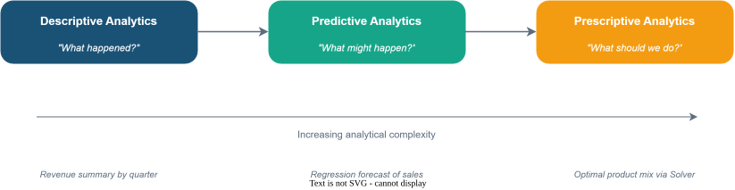
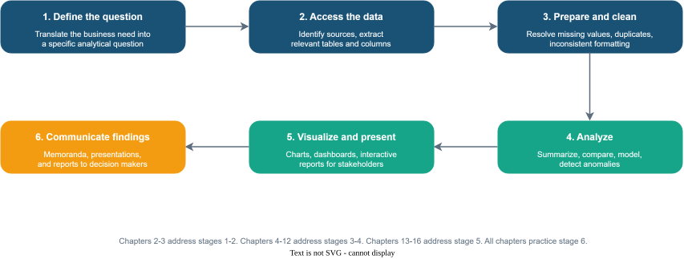
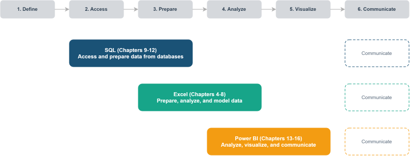
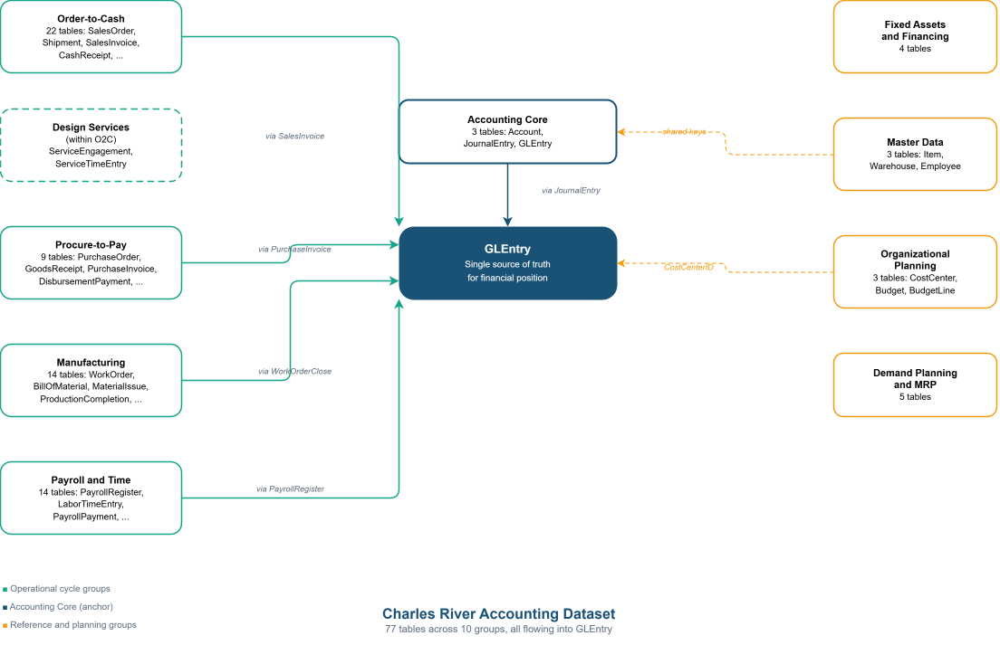
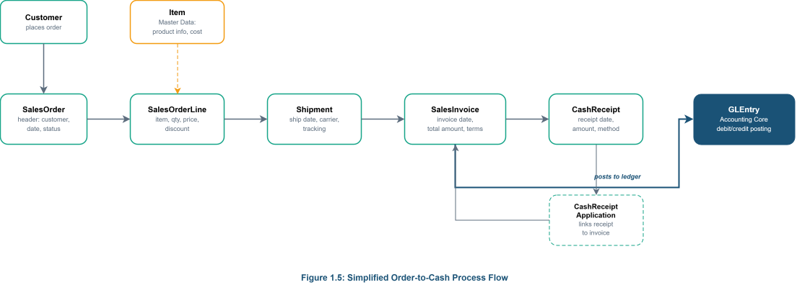
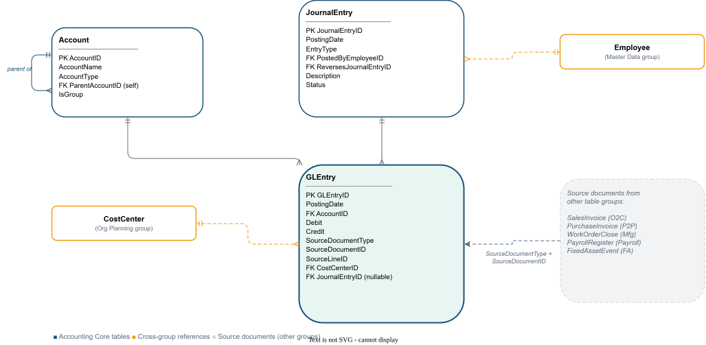
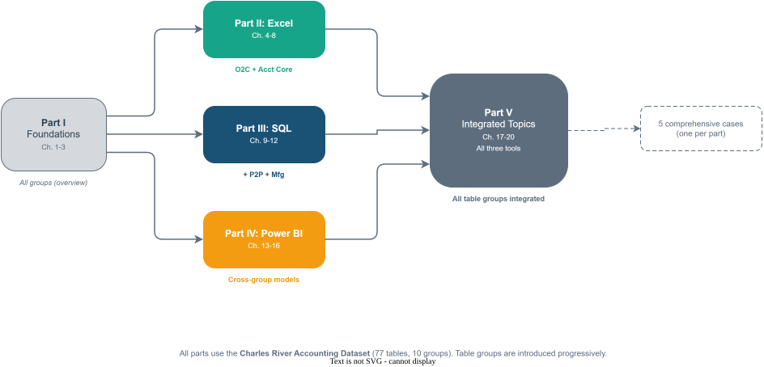

::: {.chapter-meta}
[Conceptual Chapter]{.chapter-pill}
:::

## Learning Objectives {.unnumbered}

::: {.learning-objectives}
After completing this chapter, you will be able to:

1. Explain how data analytics has changed the work accountants perform and the skills the profession demands.
2. Define descriptive, predictive, and prescriptive analytics and identify examples of each in financial accounting, managerial accounting, and auditing.
3. Describe the purpose and capabilities of Excel, SQL, and Power BI as complementary tools for accounting analytics.
4. Describe the Charles River Accounting Dataset, its business model, and how its ten table groups map to the company's business cycles.
5. Map the stages of an accounting analytics workflow from question formulation through communication of results.
:::

## Opening Scenario  {.unnumbered}

You have just started a position as a staff accountant at Charles River, a mid-size home furnishings company in the greater Boston area. During your first week, the controller asks you to investigate why gross margins on the Furniture product line declined in the most recent quarter. She tells you the data you need is spread across several tables in the company's database, including sales orders, product cost records, and the general ledger. Your accounting coursework prepared you to interpret financial statements, calculate ratios, and apply standards, but you have never pulled data directly from a database, cleaned it for analysis, or built an interactive report that the management team can explore on their own. You realize that answering the controller's question will require more than accounting knowledge. It will require the ability to extract, prepare, analyze, and communicate data. This chapter introduces the analytical mindset and the toolkit you will develop throughout this book to handle exactly this kind of challenge.

---

## The Changing Landscape of Accounting Work

The accounting profession has always been built on data. Accountants record transactions, classify them into accounts, summarize them in financial statements, and interpret the results for stakeholders. For most of the profession's history, the volume of data involved in these tasks was manageable through manual methods and later through basic spreadsheets. A general ledger might contain a few thousand entries per year, and an auditor could review a reasonable portion of those entries by hand. That era has ended.

Modern organizations generate transaction data at a scale that makes manual review impractical. A single retail company may process millions of sales transactions per month, each one recorded with a timestamp, a product identifier, a customer identifier, a store location, a payment method, and a discount code. An enterprise resource planning system at a manufacturing firm captures not only financial transactions but also production orders, material movements, quality inspections, and employee time records. The data that accountants must work with has grown by orders of magnitude, and it continues to grow (Vasarhelyi, Kogan, and Tuttle, 2015).

This growth in data has created both a challenge and an opportunity for the profession. The challenge is that traditional methods of sampling and manual review cannot keep pace with the volume and complexity of modern datasets. An auditor who selects 50 transactions from a population of 500,000 is examining one hundredth of one percent of the available evidence. The opportunity is that the same technology that generates massive datasets also provides tools to analyze entire populations rather than small samples. Accountants who can use these tools effectively bring more evidence to their conclusions, identify patterns that sampling would miss, and deliver insights that go beyond compliance and reporting (Earley, 2015).

Professional bodies have recognized this shift and responded by updating their competency frameworks. The American Institute of Certified Public Accountants has integrated data analytics into its pre-certification curriculum and its continuing education requirements. The Institute of Management Accountants has emphasized technology and analytics in its Certified Management Accountant examination content. The International Federation of Accountants has published guidance on the skills that accounting graduates need in a data-rich environment (IFAC, 2019). These developments signal that analytics is not a niche specialization within accounting. It is a core competency that every practitioner will need.

::: {.callout-tip .in-practice icon=false}
## In Practice
Accounting firms of all sizes now recruit for analytics skills alongside traditional accounting knowledge. Major firms have established dedicated data analytics practices, and even small and mid-size firms use data analysis tools for audit testing, tax planning, and advisory engagements. A 2019 survey by the Institute of Management Accountants found that data analytics ranked among the top five skills employers seek when hiring management accountants (IMA, 2019).
::: 

The purpose of this textbook is to help you develop these skills in a structured and practical way. You will learn to work with data using three tools that are widely used in practice: Microsoft Excel, SQL, and Microsoft Power BI. You will apply these tools to realistic accounting data drawn from the Charles River Accounting Dataset, a single integrated database that you will use throughout the entire book. And you will practice solving problems from three accounting perspectives: financial accounting, managerial accounting, and auditing. By the end of this book, you will be able to extract data from a database, prepare it for analysis, summarize and model it, visualize the results, and communicate your findings to professional audiences.

## Defining Accounting Analytics

Analytics is the process of examining data to draw conclusions, identify patterns, and support decisions. In accounting, analytics applies this process to financial and operational data for purposes such as reporting, planning, control, and assurance. The term "accounting analytics" as used in this textbook refers to the application of data extraction, preparation, analysis, and visualization techniques to accounting data for the purpose of producing information that supports financial reporting, managerial decision-making, and audit assurance.

It is important to distinguish accounting analytics from related terms that students may encounter. "Data analytics" is a broad term that encompasses analytical work in any domain, from marketing to healthcare to logistics. "Business intelligence" typically refers to the tools and infrastructure that organizations use to collect, store, and present data for operational and strategic decisions. "Big data" refers to datasets that are too large or complex for traditional data processing methods and is often associated with technologies such as Hadoop and cloud computing. Accounting analytics draws on all of these concepts but applies them specifically to the data, questions, and standards that define the accounting profession (Richins, Stapleton, Stratopoulos, and Wong, 2017).

### The Three Types of Analytics

A useful framework for understanding the scope of analytics divides it into three categories: descriptive, predictive, and prescriptive. These categories represent increasing levels of analytical complexity and are not mutually exclusive. Most real-world accounting analytics projects involve more than one type.

{#fig-01-01 fig-alt="A horizontal diagram showing three stages from left to right: Descriptive Analytics What happened?, Predictive Analytics What might happen?, and Prescriptive Analytics What should we do?. Each stage includes a brief accounting example beneath it."}

**Descriptive analytics** answers the question "what happened?" It involves summarizing historical data to understand past performance, identify trends, and describe the current state of affairs. Descriptive analytics is the foundation of most accounting work. When a financial analyst prepares a comparative income statement showing revenue by product line for the past four quarters, that is descriptive analytics. When an auditor stratifies accounts receivable by aging bucket to assess the adequacy of the allowance for doubtful accounts, that is also descriptive analytics. The tools of descriptive analytics include aggregation, grouping, sorting, filtering, and basic statistical measures such as totals, averages, and counts.

In the context of this textbook, descriptive analytics appears most prominently in the Excel chapters (Part II) and the introductory SQL chapters (Part III). Students will build PivotTables that summarize Charles River sales revenue by item group and quarter using the SalesOrderLine table, write SQL queries that calculate average order values by customer, and create Power BI dashboards that display key performance indicators from the general ledger. These are all descriptive tasks, and they form the base on which more advanced analysis is built.

**Predictive analytics** answers the question "what might happen?" It involves using historical data to make forecasts, estimate probabilities, and identify the factors that drive outcomes. Predictive analytics moves beyond describing the past to projecting the future. When a management accountant builds a regression model to forecast next quarter's revenue based on historical trends, that is predictive analytics. When an auditor uses statistical analysis to set an expectation for an account balance and then compares the actual balance to the expectation as a substantive analytical procedure, that too involves prediction. The tools of predictive analytics include regression analysis, trend extrapolation, time series modeling, and classification techniques.

In this textbook, predictive analytics appears in the modeling chapter of the Excel section (Chapter 7), in the intermediate SQL chapters where students use window functions for period-over-period analysis (Chapter 11), and in the Power BI chapters where DAX time intelligence functions enable rolling averages and year-over-year comparisons (Chapter 15). Students will build forecasting models using Charles River sales data, conduct sensitivity analyses on manufacturing cost assumptions, and set analytical expectations that mirror the procedures used in professional practice.

**Prescriptive analytics** answers the question "what should we do?" It involves using data analysis to recommend a course of action, often by optimizing an objective subject to constraints. Prescriptive analytics is the most advanced of the three types and is less common in current accounting practice than descriptive and predictive analytics, although it is growing. When a cost accountant uses Excel's Solver tool to determine the optimal product mix that maximizes contribution margin given production capacity constraints, that is prescriptive analytics. When a tax advisor uses scenario modeling to recommend a filing strategy that minimizes a client's tax liability across multiple jurisdictions, that also has prescriptive elements.

This textbook introduces prescriptive analytics through optimization exercises in Chapter 7 (using Solver and Scenario Manager in Excel) and through scenario analysis in the integrated chapters of Part V. The emphasis throughout the book, however, is on descriptive and predictive analytics because these represent the analytical work that accounting professionals perform most frequently.

::: {.callout-warning .watch-out icon=false}
## Watch out 
Students sometimes assume that descriptive analytics is "basic" and that the goal is to reach prescriptive analytics as quickly as possible. In practice, most accounting analytics work is descriptive, and doing it well requires substantial skill. A poorly constructed summary can mislead decision makers just as easily as a sophisticated model can. The value of analytics lies not in its complexity but in the quality of the questions it answers and the rigor of the process behind it.
:::

## Why Accountants Need Analytics Skills

The demand for analytics skills in accounting is driven by several developments that have reshaped the profession over the past two decades. Understanding these drivers helps explain why this textbook exists and why the skills it teaches matter for your career.

The first driver is the increasing availability of data. As organizations have adopted enterprise resource planning systems, cloud-based accounting platforms, and automated transaction processing, the volume of financial and operational data available for analysis has expanded dramatically. Accountants who can access and analyze this data directly, rather than waiting for IT departments to produce reports, work more efficiently and can respond to questions in real time (Appelbaum, Kogan, and Vasarhelyi, 2017).

The second driver is the evolution of audit methodology. Auditing standards increasingly encourage or require the use of data analytics. The ability to test an entire population of transactions rather than a sample changes the nature of audit evidence. Auditors who use analytics can identify anomalies that sampling would miss, perform more precise risk assessments, and provide more relevant findings to audit committees. The Public Company Accounting Oversight Board has emphasized the use of technology and data analysis in its inspection findings, and firms have responded by investing in analytics training for their audit staff (PCAOB, 2017).

The third driver is the expansion of the accountant's role from preparer and verifier to advisor and analyst. Organizations expect their accounting and finance teams to provide forward-looking analysis, scenario planning, and strategic insight, not just historical reports. Management accountants, in particular, are asked to explain why results differ from plan, to forecast future performance under different assumptions, and to identify the operational drivers behind financial outcomes. These tasks require analytical skills that go beyond debits and credits (Cokins, 2013).

The fourth driver is competitive pressure in the labor market. Graduates who can combine accounting knowledge with data analysis skills are more attractive to employers than those with accounting knowledge alone. This is true across all areas of the profession, from public accounting to industry to government. The ability to write a SQL query, build a PivotTable, or create an interactive dashboard distinguishes a candidate in a hiring process and opens career paths that were previously reserved for specialists in information systems or data science.

::: {.callout-tip .in-practice icon=false}
## In Practice
A survey of accounting professionals conducted by Kokina and Dagiliene (2017) found that respondents identified data analysis and technology skills as the area of greatest change in the competencies required of accountants. Respondents across audit, tax, and advisory roles reported that they spend more time working with data tools than they did five years earlier and expected that trend to continue.
:::

## Table 1.1: Examples of Analytics Applications by Accounting Role

| Role | Descriptive Example | Predictive Example |
|---|---|---|
| Financial Reporting | Comparative income statement showing revenue by item group for the past four quarters | Revenue forecast for the next fiscal quarter using trend extrapolation of historical Charles River sales data |
| Managerial Accounting | Product profitability ranking by item group based on standard cost and list price from the Item table | Cost-volume-profit model projecting break-even points for the Furniture product line under three pricing scenarios |
| External Audit | Stratification of Charles River sales invoices by aging bucket to evaluate the allowance for doubtful accounts | Regression-based expectation for monthly revenue used as a substantive analytical procedure |
| Internal Audit | Frequency distribution of DisbursementPayment amounts to identify concentrations near approval thresholds | Risk scoring of journal entries from the Accounting Core based on multiple indicators to prioritize selections for testing |

## The Accounting Analytics Workflow

Before learning specific tools, it is helpful to understand the general process that all accounting analytics projects follow. Whether you are building a revenue summary in Excel, writing an audit query in SQL, or designing a dashboard in Power BI, the work progresses through the same sequence of stages. This textbook is organized around these stages, and understanding them now will help you see how the chapters connect.

{#fig-01-01 fig-alt="A process flowchart showing six stages in sequence: (1) Define the Question, (2) Identify and Access the Data, (3) Prepare and Clean the Data, (4) Analyze the Data, (5) Visualize and Present the Results, (6) Communicate Findings and Recommendations. Each stage includes a one-sentence description."}

The first stage is defining the question. Every analytics project begins with a clear statement of the problem or question to be addressed. In the opening scenario of this chapter, the controller's question was specific: why did gross margins on the Furniture product line decline in the most recent quarter? A well-defined question guides every subsequent decision, from which data to collect to which visualizations to create. Vague questions produce vague answers. The ability to translate a business concern into an analytical question is one of the most important skills an accountant can develop.

The second stage is identifying and accessing the data. Once the question is defined, the accountant must determine which data is needed and where it resides. In many organizations, the relevant data is stored in databases that are part of the company's ERP system or accounting software. Accessing this data may require writing SQL queries to extract the relevant tables and columns. In other cases, the data may be available in spreadsheet exports or flat files. Chapter 2 and Chapter 3 of this textbook address this stage by teaching students how accounting data is structured and stored within the Charles River database.

The third stage is preparing and cleaning the data. Raw data almost always contains problems that must be resolved before analysis can begin. Missing values, duplicate records, inconsistent formatting, and incorrect data types are common in accounting datasets. Data preparation is often the most time-consuming stage of an analytics project, and it is also the most important. Analysis performed on dirty data produces unreliable results. Chapters 4 and 5 cover data preparation in Excel, and Chapters 9 and 10 cover data extraction and joining in SQL.

The fourth stage is analyzing the data. This is where the accountant applies techniques such as summarization, comparison, trend analysis, regression, and anomaly detection to answer the question defined in the first stage. The choice of technique depends on the question and the type of data available. Chapters 6 through 8 cover analysis in Excel, Chapters 10 through 12 cover analysis in SQL, and Chapters 15 and 16 cover analysis in Power BI.

The fifth stage is visualizing and presenting the results. Data visualization transforms analytical results into visual formats that audiences can interpret quickly and accurately. A well-designed chart, table, or dashboard communicates the answer to the original question more effectively than a spreadsheet full of numbers. Chapter 13 covers visualization principles, and Chapters 14 through 16 teach students to build interactive reports and dashboards in Power BI.

The sixth stage is communicating findings and recommendations. The final product of an analytics project is not a spreadsheet or a dashboard but a communication to decision makers. That communication might take the form of a written memorandum to an audit committee, a presentation to management, or an interactive report that stakeholders can explore. The ability to translate analytical results into clear, professional language is essential. This skill is practiced throughout the textbook in the applied exercises and comprehensive cases, each of which asks students to produce a written interpretation alongside their technical work.

::: {.callout-note .connecting-dots icon=false}
## Connecting the Dots
The six-stage workflow described here is not unique to accounting. It closely parallels the data analysis process described in data science and business intelligence literature (Provost and Fawcett, 2013). What makes accounting analytics distinctive is not the process itself but the data it works with (financial and operational transactions), the questions it addresses (reporting, control, assurance), and the professional standards that govern the work (GAAP, GAAS, IMA ethical standards). Throughout this book, the workflow provides the thread that connects every chapter and every tool.
:::

## The Tools of This Textbook

This textbook uses three tools: Microsoft Excel, SQL (Structured Query Language), and Microsoft Power BI. These tools were selected because they are widely used in accounting practice, they are accessible to students without programming backgrounds, and together they cover the full analytics workflow from data preparation through visualization.

### Microsoft Excel

Excel is the most widely used analytical tool in the accounting profession. Nearly every accountant works with Excel on a daily basis, and most accounting graduates enter the workforce with at least basic spreadsheet skills. This textbook builds on that foundation and extends it into areas that many students have not explored, including structured Excel Tables, PivotTables, statistical functions, Power Query for data preparation, the Data Analysis ToolPak for regression, and Solver for optimization.

Excel is most powerful when working with datasets that fit comfortably in a spreadsheet, typically up to a few hundred thousand rows. It excels at ad hoc analysis, where the accountant needs to explore data interactively, try different approaches, and produce results quickly. Excel is also the primary tool for building financial models, conducting what-if analysis, and preparing workpapers that document analytical procedures.

Part II of this textbook (Chapters 4 through 8) is devoted to Excel. Students will work primarily with the Charles River Order-to-Cash and Accounting Core table groups, learning to import, clean, summarize, model, and test accounting data using features that go well beyond basic formulas and formatting.

### SQL (Structured Query Language)

SQL is the standard language for accessing data stored in relational databases. It allows accountants to extract exactly the data they need from large, complex databases without relying on pre-built reports or IT intermediaries. SQL is particularly important for accountants who work with ERP systems, because the underlying data in these systems is stored in relational databases that SQL can query directly.

SQL is most powerful when working with large datasets, when the data spans multiple related tables that must be joined together, and when the same analysis needs to be performed repeatedly. An auditor who writes a SQL query to identify duplicate payments in the Charles River DisbursementPayment table can run that same query every quarter with no additional effort. A financial analyst who writes a query to produce a revenue summary by item group and customer segment can reuse that query whenever the data is updated.

Part III of this textbook (Chapters 9 through 12) is devoted to SQL. Students will expand into the Procure-to-Pay and Manufacturing table groups, where relational joins become essential for combining data across multiple tables.

### Microsoft Power BI

Power BI is a business intelligence platform that enables accountants to build interactive dashboards and reports. It connects to a wide range of data sources (including Excel files and SQL databases), provides a data modeling layer for defining relationships and calculations, and offers a rich set of visualization tools for presenting results.

Power BI is most powerful when the goal is to create a reusable, interactive report that multiple stakeholders can explore. A management accountant who builds a budget-versus-actual dashboard in Power BI gives every department manager the ability to filter the report to their own cost center, drill down into specific line items, and compare results across periods. An audit team that builds an anomaly detection dashboard creates a monitoring tool that can be refreshed with new data each audit cycle.

Part IV of this textbook (Chapters 13 through 16) is devoted to Power BI. Students will build data models that span multiple Charles River table groups, learning visualization principles, the Power BI interface, data modeling with DAX, and interactive dashboard design.

{#fig-01-03 fig-alt="he Three Tools and Their Roles in the Analytics Workflow. A diagram showing Excel, SQL, and Power BI mapped to the six stages of the analytics workflow, indicating where each tool is primarily used. SQL maps primarily to stages 2 and 3 (accessing and preparing data). Excel maps primarily to stages 3 and 4 (preparing and analyzing data). Power BI maps primarily to stages 4 and 5 (analyzing and visualizing data). All three tools contribute to stage 6 (communication)."}

::: {.callout-note .connecting-dots icon=false}
## Connecting the Dots
Part V of this textbook (Chapters 17 through 20) integrates all three tools using the full Charles River database. In those chapters, you will work through scenarios that begin with SQL to extract data from the database, move to Excel for detailed analysis and modeling, and finish in Power BI for visualization and presentation. This integrated approach mirrors how analytics projects work in practice, where no single tool handles every stage of the workflow.
:::

## The Charles River Accounting Dataset

This textbook is built around one integrated dataset: the Charles River Accounting Dataset, a process-to-ledger teaching database that follows a single fictional company through its complete business cycles. The dataset is provided in three formats: an SQLite database for SQL work, an Excel workbook for spreadsheet analysis, and a CSV package for flexible import into any tool including Power BI. This means you will work with the same underlying data regardless of whether you are using Excel, SQL, or Power BI in a given chapter.

### The Company

Charles River is a fictional mid-size company situated in the greater Boston area that designs and sells home furnishings through wholesale and direct-to-business channels. The product catalog includes furniture, lighting, textiles, and decorative accessories organized into product families that you can visualize and compare analytically. Charles River manufactures selected product lines in-house from raw materials and packaging, purchases other finished goods from domestic and international suppliers, and warehouses inventory across multiple locations. The company also operates an interior design services practice that bills customers by the hour, giving students a second revenue model within the same business. Charles River employs approximately 60 people across six departments and maintains a full chart of accounts with cost center tracking.

This hybrid operating model is a deliberate design choice. A company that both buys and makes products, sells both goods and services, and manages both manufacturing labor and salaried professionals creates the range of accounting transactions that students need to encounter. You can compare purchased products with manufactured products, trace how customer demand drives purchasing and production decisions, analyze how labor supports both operations and services, and see how all of these activities flow into the general ledger.

### Why One Dataset

Using a single company throughout the entire book means you learn one business deeply rather than multiple businesses superficially. Every chapter builds on the same data environment. A customer order analyzed in an Excel chapter appears in the general ledger queried in a SQL chapter and surfaces in a Power BI dashboard built in a later chapter. This continuity reinforces learning and mirrors real professional practice, where accountants work within one company's data for extended periods.

### The Table Groups

The Charles River database contains 77 tables organized into ten groups. The book introduces these groups progressively, starting with the most accessible tables and expanding as you build skill.

The **Accounting Core** group contains three tables: Account, JournalEntry, and GLEntry. These represent the chart of accounts, the finance-controlled journal headers, and the posted ledger detail. Every business cycle in the database ultimately flows into GLEntry, making it the single source of truth for the company's financial position. This group is the anchor for financial reporting, audit analytics, and period-close analysis throughout the book.

The **Order-to-Cash** group contains 22 tables covering the full revenue cycle from customer order through cash collection. This group includes sales orders, shipments, invoices, cash receipts, commercial pricing, design service engagements and billing, sales commissions, and a complete returns and credits chain. It is the richest group in the database, and the one you will work with first in the Excel and SQL chapters.

The **Procure-to-Pay** group contains nine tables covering the full purchasing cycle from internal requisition through vendor payment, including purchase orders, goods receipts, supplier invoices, and disbursement payments. This group supports three-way matching, vendor analytics, and accounts payable management exercises.

The **Manufacturing** group contains 14 tables covering production planning, material usage, labor support, production completion, and variance analysis. Tables include bills of material, routings, work centers, work orders, material issues, and work order close records. This group is particularly valuable for cost accounting exercises.

The **Payroll and Time** group contains 14 tables covering workforce management from shift scheduling through payroll settlement, including time clock entries, labor time entries, payroll registers, payroll payments, and liability remittances. This group supports labor cost analysis and payroll compliance testing.

The **Fixed Assets and Financing** group contains four tables covering the fixed asset subledger including acquisition, depreciation, and disposal, along with note-payable financing through debt agreements and amortization schedules.

The **Master Data** group contains three shared reference tables: Item, Warehouse, and Employee. These are used across all other groups for product, location, and people information.

The **Organizational Planning** group contains three tables: CostCenter, Budget, and BudgetLine. These define the departmental structure and monthly budget allocations for management reporting.

The **Demand Planning and MRP** group contains five tables covering demand forecasting, inventory policy, supply plan recommendations, material requirements planning, and rough-cut capacity planning.

## Table 1.2: The Charles River Table Groups

| Table Group | Number of Tables | Key Tables | Primary Accounting Use |
|---|---|---|---|
| Accounting Core | 3 | Account, JournalEntry, GLEntry | Financial reporting, audit analytics, period-close analysis |
| Order-to-Cash (O2C) | 22 | Customer, SalesOrder, SalesOrderLine, Shipment, SalesInvoice, CashReceipt, ServiceEngagement | Revenue analysis, receivables management, design services margin analysis |
| Procure-to-Pay (P2P) | 9 | PurchaseOrder, PurchaseOrderLine, GoodsReceipt, PurchaseInvoice, DisbursementPayment | Purchasing analytics, three-way matching, vendor evaluation, duplicate payment detection |
| Manufacturing | 14 | WorkOrder, BillOfMaterial, MaterialIssue, ProductionCompletion, WorkOrderClose | Standard cost versus actual cost analysis, production performance, material usage variance |
| Payroll and Time | 14 | PayrollRegister, LaborTimeEntry, PayrollPayment, TimeClockEntry | Labor cost analysis, payroll compliance testing, workforce analytics |
| Fixed Assets and Financing | 4 | FixedAsset, FixedAssetEvent, DebtAgreement, DebtScheduleLine | Depreciation analysis, asset lifecycle tracking, debt amortization |
| Master Data | 3 | Item, Warehouse, Employee | Shared reference data for products, locations, and people across all groups |
| Organizational Planning | 3 | CostCenter, Budget, BudgetLine | Departmental budgetary control, responsibility accounting, budget-versus-actual analysis |
| Demand Planning and MRP | 5 | DemandForecast, InventoryPolicy, SupplyPlanRecommendation, MaterialRequirementPlan, RoughCutCapacityPlan | Demand forecasting, inventory optimization, production planning |

### The Business Cycles

The table groups map to six business cycles that define how Charles River operates. The Order-to-Cash cycle traces customer demand from sales orders through shipments, invoicing, and cash receipts. The Design Services cycle (a branch within the O2C group) covers hourly consulting engagements that are staffed, approved, and billed monthly, creating a second revenue path alongside product sales. The Procure-to-Pay cycle covers replenishment from requisition through purchasing, goods receipt, and vendor payment. The Manufacturing cycle turns selected products into finished goods through planning, work orders, material issue, labor support, and production completion. The Payroll cycle processes employee time records into payroll registers, payments, and remittances. The Manual Journals and Close cycle handles accruals, reclassifications, and period-end adjustments through the JournalEntry table. Every one of these cycles ultimately flows into GLEntry, where the entire company's financial activity is recorded.

{#fig-01-04 fig-alt="A diagram showing the ten table groups as connected blocks, with GLEntry at the center. Arrows show how each business cycle flows into the general ledger. The O2C group connects through SalesInvoice, the P2P group connects through PurchaseInvoice, the Manufacturing group connects through WorkOrderClose, the Payroll group connects through PayrollRegister, and the JournalEntry table handles manual entries."}

{#fig-01-05 fig-alt="A horizontal flowchart showing the Order-to-Cash path: Customer places a SalesOrder, which generates SalesOrderLines. The order is fulfilled through a Shipment, which triggers a SalesInvoice. The customer pays through a CashReceipt, which is applied via CashReceiptApplication. The SalesInvoice generates GLEntry records in the Accounting Core."}

{#fig-01-06 fig-alt="Shows the three Accounting Core tables (Account, JournalEntry, GLEntry) and their relationships. Account has a self-referencing parent hierarchy. JournalEntry connects to GLEntry through JournalEntryID. GLEntry also receives entries from source documents identified by SourceDocumentType and SourceDocumentID."}

::: {.callout-warning .watch-out icon=false}
## Watch out
The Charles River dataset is a fictional company created for educational purposes. It is designed to illustrate realistic data structures and analytical challenges, but it does not represent the full complexity or messiness of real-world data. Real ERP systems may contain hundreds of tables, custom fields, and data quality problems that exceed what you will encounter in this dataset. The skills you learn here will transfer to real-world environments, but you should expect that professional practice will require additional adaptation and judgment.
:::

## Guided Tutorial 1.1: Exploring the Charles River Database

**Context and objective.** In this tutorial, you will open the Charles River dataset in Excel and examine its structure across several table groups. The goal is not to perform any analysis but to build familiarity with the tables, columns, and business context of the database. By the end of this tutorial, you will know what data is available and where to find it.

**Prerequisites.** You need Microsoft Excel installed on your computer and access to the Charles River Excel workbook file provided with this textbook: CharlesRiver.xlsx.

**Step-by-step instructions.**

**Step 1.** Open the file CharlesRiver.xlsx in Excel. Notice that the workbook contains a large number of worksheets, each representing one table in the Charles River database. Click through several worksheet tabs at the bottom of the screen and note the variety of table names. You will see worksheets organized across multiple business areas, from Customer and SalesOrder through WorkOrder and PayrollRegister.

**Step 2.** Click on the Customer worksheet. Examine the column headers in row 1. You should see columns including CustomerID, CustomerName, Segment, Region, CreditLimit, and PaymentTerms. Scroll down to get a sense of the number of records. Note the Segment column, which classifies customers as Wholesale or Direct.

**Step 3.** Click on the SalesOrder worksheet. Examine the columns, which include SalesOrderID, CustomerID, OrderDate, RequestedDeliveryDate, SalesRepEmployeeID, and Status. Notice that CustomerID appears in both the Customer and SalesOrder worksheets. This column links the two tables together, a concept you will study in depth in Chapter 3 and use extensively when writing SQL joins in Chapters 10 and 11.

*[Figure 1.7: Screenshot of the Charles River SalesOrder worksheet in Excel, showing column headers and the first several rows of data. Annotated callouts identify the SalesOrderID, CustomerID, OrderDate, and Status columns.]*

**Step 4.** Click on the Item worksheet. Examine the columns, which include ItemID, ItemName, ItemGroup, SupplyMode, StandardCost, and ListPrice. Notice the ItemGroup column, which classifies products into four categories: Furniture, Lighting, Textiles, and Accessories. Notice also the SupplyMode column, which indicates whether each item is Purchased (bought from a supplier) or Manufactured (produced in-house). These distinctions will be important for cost analysis and manufacturing exercises in later chapters.

**Step 5.** Click on the Account worksheet. Examine the columns, which include AccountID, AccountName, AccountType, and ParentAccountID. This is the chart of accounts for Charles River, and it forms the backbone of the Accounting Core. The ParentAccountID column creates a hierarchical structure that organizes accounts into groups such as Assets, Liabilities, Equity, Revenue, and Expenses.

**Step 6.** Click on the GLEntry worksheet. Examine the columns, which include GLEntryID, PostingDate, AccountID, Debit, Credit, SourceDocumentType, SourceDocumentID, and CostCenterID. This table contains the individual debit and credit entries that make up the general ledger. The SourceDocumentType column tells you which business cycle generated each entry, such as "SalesInvoice" or "PurchaseInvoice" or "JournalEntry." Every financial transaction in the Charles River system is recorded here, and you will use this table extensively in the audit and financial reporting chapters.

**Step 7.** Click on one manufacturing table (such as WorkOrder) and one payroll table (such as PayrollRegister). Examine the columns briefly. Notice that the database contains far more than just sales and accounting data. Work orders track production with columns for product, quantity, start date, and status. Payroll registers track pay periods with columns for employee, gross pay, deductions, and net pay. These table groups will become important in the SQL and Power BI sections of the book.

**Checkpoint.** At this point, you should have examined worksheets from at least four table groups (O2C, Master Data, Accounting Core, and either Manufacturing or Payroll). You should be able to answer the following questions: How many item groups does Charles River sell? (Four: Furniture, Lighting, Textiles, and Accessories.) What column in GLEntry traces each entry back to its source document? (SourceDocumentType.) Which worksheet contains the chart of accounts? (Account.) If you can answer these three questions, you are ready to proceed.

## How This Book Is Organized

This textbook is organized into five parts that follow the progression of the analytics workflow and introduce tools in a sequence designed for students with no prior analytics or programming experience. The book also introduces Charles River table groups progressively, starting with the most accessible tables and expanding as students build skill.

**Part I, Foundations of Accounting Analytics** (Chapters 1 through 3), establishes the conceptual groundwork. You are in Part I now. Chapter 2 will teach you to think critically about accounting data, including its types, sources, and quality dimensions. Chapter 3 will introduce the relational database model and show you how accounting data is organized within the Charles River database. Part I uses the full database at a conceptual level for orientation.

**Part II, Accounting Analytics with Excel** (Chapters 4 through 8), teaches you to use Excel as an analytical tool. These chapters move from data organization and cleaning through summarization, modeling, and audit-specific analytics. Part II works primarily with the O2C core tables (Customer, SalesOrder, SalesOrderLine, Item) and the Accounting Core (Account, GLEntry, JournalEntry). By the end of Part II, you will be able to build PivotTables, run regressions, perform Benford's Law analysis, and prepare professional analytical workpapers.

**Part III, Accounting Analytics with SQL** (Chapters 9 through 12), teaches you to query relational databases using SQL. These chapters start with the basic SELECT statement and progress through joins, aggregation, window functions, and audit analytics queries. Part III expands into the Procure-to-Pay and Manufacturing table groups, where relational joins become essential. By the end of Part III, you will be able to write SQL queries that extract, join, summarize, and test accounting data directly from the database.

**Part IV, Data Visualization and Power BI** (Chapters 13 through 16), teaches you to build interactive reports and dashboards. These chapters begin with visualization principles and progress through Power BI basics, data modeling with DAX, and full dashboard design. Part IV builds data models that span multiple table groups. By the end of Part IV, you will be able to build professional dashboards for financial reporting, operational management, and audit monitoring.

**Part V, Integrated and Applied Topics** (Chapters 17 through 20), brings everything together. These chapters apply the full toolkit to financial reporting analytics, cost and management accounting analytics, forensic accounting and fraud detection, and emerging technologies. Part V integrates across all table groups, and the chapters require you to move between Excel, SQL, and Power BI within a single project, just as you would in professional practice.

{#fig-01-08 fig-alt="A visual roadmap showing the five parts of the book as a progression from left to right. Part I (Foundations, all groups at overview) leads to Part II (Excel, O2C and Accounting Core), Part III (SQL, adds P2P and Manufacturing), and Part IV (Power BI, cross-group models), which converge into Part V (Integrated Topics, all groups). Each part shows its chapter numbers and the primary table groups used."}

Each chapter follows a consistent structure. It opens with learning objectives and a motivating scenario set at Charles River, presents concepts through narrative explanation and guided tutorials, and closes with a summary, key terms, review questions, and applied exercises organized by three accounting perspectives: Financial Accounting, Managerial Accounting, and Auditing. Five comprehensive cases, one at the end of each part, provide extended multi-tool investigations that integrate the material from all chapters in that part.

::: {.callout-tip .in-practice icon=false}
## In Practice
The three-perspective exercise structure in this book reflects how analytics is used across the accounting profession. The same technique, such as aging analysis, serves different purposes depending on the role. A financial accountant uses aging analysis to estimate the allowance for doubtful accounts. A managerial accountant uses it to assess collection efficiency and cash flow timing. An auditor uses it to evaluate management's estimates and to identify balances for confirmation testing. Seeing these connections will help you understand why a single analytical skill has broad professional value.
:::

## Looking Ahead

This chapter has introduced the concept of accounting analytics, defined the three types of analytics, described the tools and the Charles River dataset you will use throughout the book, and outlined the analytical workflow that connects every chapter. In the next chapter, you will take a closer look at accounting data itself. You will learn to distinguish different data types, identify common data quality problems, and understand why the quality of your data determines the quality of your analysis. The practical skills begin in Chapter 2, and they build steadily from that point forward.

## Chapter Summary

The accounting profession is undergoing a fundamental shift in the skills it demands from practitioners. The growth of transaction data, the evolution of audit methodology, and the expansion of the accountant's role from preparer to analyst have created strong demand for data analytics competencies. Professional bodies including the AICPA, IMA, and IFAC have responded by integrating analytics into their competency frameworks, signaling that these skills are essential rather than optional.

Analytics in accounting takes three forms. Descriptive analytics summarizes historical data to explain what happened. Predictive analytics uses historical patterns to forecast future outcomes. Prescriptive analytics recommends actions by optimizing objectives subject to constraints. Most accounting analytics work is descriptive or predictive, and doing this work well requires both technical skill and professional judgment.

This textbook teaches accounting analytics using three tools (Excel, SQL, and Power BI) applied to the Charles River Accounting Dataset, a single integrated database containing 77 tables organized in ten groups. The tools cover the full analytics workflow from data access through visualization and communication. The book introduces the table groups progressively, starting with the O2C and Accounting Core groups in the Excel chapters, expanding into P2P and Manufacturing in the SQL chapters, building cross-group models in Power BI, and integrating all groups in the applied chapters of Part V.

Every analytical project follows a consistent workflow: define the question, access the data, prepare and clean the data, analyze it, visualize the results, and communicate findings. This workflow provides the organizing thread for the entire book. The chapters are arranged so that students develop foundational skills in Parts I through IV and then apply them in integrated, multi-tool projects in Part V.

## Key Terms

**Accounting analytics.** The application of data extraction, preparation, analysis, and visualization techniques to financial and operational data for the purpose of supporting financial reporting, managerial decision-making, and audit assurance.

**Analytics workflow.** The sequence of stages that an accounting analytics project follows, from defining the question through communicating findings. The six stages are question definition, data identification, data preparation, analysis, visualization, and communication.

**Business cycle.** A sequence of related business activities that form a complete process. Charles River's six business cycles (Order-to-Cash, Design Services, Procure-to-Pay, Manufacturing, Payroll, and Manual Journals and Close) each flow through multiple table groups and ultimately into the general ledger.

**Chart of accounts.** A structured list of all accounts used by an organization to record financial transactions, organized by account type (assets, liabilities, equity, revenue, expenses). In the Charles River database, the chart of accounts is stored in the Account table within the Accounting Core group.

**Data analytics.** A broad term for the process of examining data to draw conclusions, identify patterns, and support decisions. Accounting analytics is a specific application of data analytics to accounting data and questions.

**Descriptive analytics.** The type of analytics that summarizes and describes historical data to answer the question "what happened?" Examples in accounting include financial statement preparation, variance reports, and aging analyses.

**Enterprise resource planning (ERP) system.** An integrated software platform that organizations use to manage business processes across departments, including accounting, sales, purchasing, production, and human resources. The Charles River database mirrors the structure of a production ERP system, with table groups that correspond to the functional modules found in commercial ERP platforms.

**Entity-Relationship (ER) diagram.** A visual representation of the tables in a database and the relationships between them. ER diagrams show how tables are connected through primary and foreign keys.

**Foreign key.** A column in a database table that references the primary key of another table, establishing a relationship between the two tables. For example, the CustomerID column in the Charles River SalesOrder table is a foreign key that references the CustomerID column in the Customer table.

**General ledger.** The complete record of all financial transactions for an organization, organized by account. In the Charles River database, the general ledger is represented by the GLEntry table within the Accounting Core group.

**Power BI.** A business intelligence platform developed by Microsoft that enables users to connect to data sources, build data models, and create interactive visualizations and dashboards.

**Predictive analytics.** The type of analytics that uses historical data to forecast future outcomes and estimate probabilities. Examples in accounting include revenue forecasting, regression-based analytical procedures, and credit risk assessment.

**Prescriptive analytics.** The type of analytics that recommends actions by optimizing an objective subject to constraints. Examples in accounting include product mix optimization, tax strategy planning, and resource allocation modeling.

**Primary key.** A column (or combination of columns) in a database table that uniquely identifies each row. For example, SalesOrderID is the primary key of the Charles River SalesOrder table.

**Relational database.** A system for storing data in tables that are connected to one another through defined relationships. The Charles River dataset is provided as a relational database in SQLite format, as well as in Excel workbook and CSV formats.

**SQL (Structured Query Language).** The standard language for accessing, querying, and manipulating data stored in relational databases. Part III of this textbook teaches SQL using the Charles River SQLite database.

**SQLite.** A lightweight relational database system that stores the entire database in a single file. This textbook uses SQLite because it requires no server installation and runs on any operating system.

**Table group.** A named subset of related tables within the Charles River database that corresponds to a business process or functional area. The ten table groups are Accounting Core, Order-to-Cash, Procure-to-Pay, Manufacturing, Payroll and Time, Fixed Assets and Financing, Master Data, Organizational Planning, and Demand Planning and MRP.

## Multiple Choice Questions

**1.** Which of the following best describes the primary reason that analytics skills have become essential for accounting professionals?

A. Accounting standards now require the use of data visualization tools in all financial reports.
B. The volume and complexity of financial and operational data have grown beyond what traditional manual methods can effectively analyze.
C. Analytics skills have replaced the need for accountants to understand generally accepted accounting principles.
D. Employers prefer to hire data scientists rather than accountants for financial reporting roles.

**2.** A management accountant prepares a report showing total manufacturing costs by product line for the past four quarters and calculates the percentage change from quarter to quarter. This activity is best classified as which type of analytics?

A. Prescriptive analytics
B. Predictive analytics
C. Descriptive analytics
D. Diagnostic analytics

**3.** An auditor builds a regression model using monthly revenue data from the prior year to establish an expected range for current-year monthly revenue. The auditor then compares actual monthly revenue to the expected range and investigates months where the difference exceeds the threshold. This procedure involves which type of analytics?

A. Descriptive analytics only
B. Predictive analytics
C. Prescriptive analytics
D. None of the above, because regression is a statistical technique rather than an analytics type

**4.** A cost accountant uses Excel's Solver tool to determine the combination of products that maximizes total contribution margin given constraints on machine hours and raw material availability. This activity is best classified as which type of analytics?

A. Descriptive analytics
B. Predictive analytics
C. Prescriptive analytics
D. Exploratory analytics

**5.** Which of the following is the correct sequence of stages in the accounting analytics workflow as described in this chapter?

A. Access data, define the question, analyze, clean, visualize, communicate
B. Define the question, access data, clean and prepare data, analyze, visualize, communicate
C. Analyze data, define the question, visualize, clean, communicate, access data
D. Define the question, visualize, access data, analyze, clean, communicate

**6.** Which Charles River table group contains the chart of accounts, journal entries, and posted ledger detail?

A. Order-to-Cash
B. Master Data
C. Accounting Core
D. Organizational Planning

**7.** Which tool covered in this textbook is most appropriate for extracting data directly from a relational database?

A. Microsoft Excel
B. SQL
C. Microsoft Power BI
D. The Data Analysis ToolPak

**8.** The textbook introduces the Order-to-Cash and Accounting Core table groups before the Manufacturing and Payroll groups primarily because:

A. Manufacturing and Payroll data is less important for accounting analysis than sales and ledger data.
B. The O2C and Accounting Core tables are the most accessible starting point for students who are new to analytics tools, and the book builds from simpler to more complex table groups.
C. Manufacturing and Payroll tables use a different database format that requires advanced SQL skills.
D. Students must complete all O2C exercises before the Manufacturing tables become available in the dataset.

**9.** Which professional organization's competency framework has been updated to include data analytics as a core skill for management accountants?

A. The Financial Accounting Standards Board (FASB)
B. The Institute of Management Accountants (IMA)
C. The Securities and Exchange Commission (SEC)
D. The International Accounting Standards Board (IASB)

**10.** An accountant needs to create an interactive dashboard that allows multiple department managers to filter financial results to their own cost center and drill down into individual line items. Which tool is best suited for this purpose?

A. A SQL query
B. A static Excel spreadsheet
C. Microsoft Power BI
D. The Excel Data Analysis ToolPak

**11.** In the context of a relational database, a foreign key is best described as:

A. A column that uniquely identifies each row in its own table
B. A column in one table that references the primary key of another table, establishing a relationship between them
C. A password or security credential used to access the database
D. A column that stores encrypted financial data for confidentiality purposes

**12.** According to this chapter, which stage of the analytics workflow is typically the most time-consuming?

A. Defining the question
B. Data preparation and cleaning
C. Visualization
D. Communication of findings

**13.** Which Charles River table group is most valuable for managerial accounting exercises involving production cost variance analysis?

A. Order-to-Cash
B. Manufacturing
C. Accounting Core
D. Master Data

**14.** Which of the following best describes why this textbook uses a single dataset throughout all twenty chapters rather than multiple separate databases?

A. A single database requires less storage space on student computers than multiple databases.
B. Students learn one company's data deeply rather than multiple companies superficially, and a customer order analyzed in Excel appears in the general ledger queried in SQL and surfaces in a Power BI dashboard built later.
C. The Charles River database is the only dataset available in both Excel and SQLite formats.
D. Using a single dataset allows the textbook to avoid teaching SQL joins, which require multiple tables.

**15.** A financial analyst uses PivotTables to summarize total revenue by item group and fiscal quarter using the Charles River SalesOrderLine table. The analyst notices that revenue in the Furniture group declined sharply in the third quarter and investigates the underlying transactions to determine the cause. The summarization step is an example of descriptive analytics. What type of analytics would applying a regression model to forecast fourth-quarter Furniture revenue represent?

A. Descriptive analytics
B. Predictive analytics
C. Prescriptive analytics
D. The regression would not be considered analytics because it involves statistics

## Applied Exercises

### Financial Accounting Exercises

**Exercise 1.1: Mapping Table Groups to the Financial Reporting Cycle**

**Table group:** All groups (overview level)

**Scenario.** You are a financial reporting analyst at Charles River. Your supervisor has asked you to prepare a memorandum that maps the company's data environment to common financial reporting needs. The supervisor wants to understand which table groups and specific tables contain the data needed for revenue analysis, accounts receivable management, inventory valuation, and general ledger reporting.

**Requirements.** 

(1) Open the Charles River Excel workbook and examine worksheets from at least four table groups: Order-to-Cash, Master Data, Accounting Core, and Manufacturing. For each group, identify which tables contain data that relates to revenue recognition, accounts receivable, inventory, and cost of goods sold. 

(2) For each of the four financial reporting areas listed above, identify the specific tables and columns you would use. Write a brief explanation (two to three sentences) for each area. 

(3) Identify one financial reporting task that requires combining data from the O2C group with data from the Accounting Core group, and explain which tables you would need from each group and why. 

(4) Prepare a one-page summary memorandum presenting your findings in a format suitable for your supervisor.

**Deliverable.** A one-page written memorandum that maps Charles River table groups to financial reporting needs, identifying specific tables and explaining your reasoning.

**Exercise 1.2: Tracing the Revenue Path from Order to Ledger**

**Table group:** O2C and Accounting Core

**Scenario.** You are a staff accountant preparing for the quarterly close. Your manager has asked you to document the complete path that a revenue transaction follows through the Charles River database, from the initial customer order through cash collection and general ledger posting.

**Requirements.** 

(1) Open the Charles River Excel workbook and examine the following worksheets in order: SalesOrder, SalesOrderLine, Shipment, SalesInvoice, CashReceipt, and GLEntry. For each table, note the key columns that link it to the next table in the sequence. 

(2) Write a narrative description (one paragraph per table) explaining what each table records and how it connects to the next step in the revenue process. 

(3) Identify the column in GLEntry that tells you the entry originated from a sales invoice rather than a journal entry or a payroll transaction. 

(4) Write a brief comparison (three to five sentences) explaining what information is available in the SalesInvoice table that is not available in the GLEntry table, and why an analyst might need to access both.

**Deliverable.** A written description of the revenue transaction path through the Charles River database, with specific table and column references.

### Managerial Accounting Exercises

**Exercise 1.3: Evaluating Table Groups for Cost Analysis**

**Table group:** Manufacturing, Organizational Planning, and Payroll

**Scenario.** You are a management accountant at Charles River. Your controller has asked you to assess which table groups contain the information needed for a product cost analysis and a departmental budget review.

**Requirements.** 

(1) Open the Charles River Excel workbook and examine worksheets from the Manufacturing group (such as WorkOrder, BillOfMaterial, MaterialIssue, ProductionCompletion, and WorkOrderClose). List the table names and the columns most relevant to understanding product costs. 

(2) Examine worksheets from the Organizational Planning group (CostCenter, Budget, BudgetLine). List the table names and columns relevant to departmental budgeting. 

(3) Determine which group is better suited for product-level cost analysis (comparing standard cost to actual production cost) and which is better suited for departmental budget analysis (comparing budgeted amounts to actual spending by department). Explain your reasoning in three to five sentences. 

(4) Identify one managerial accounting question that requires data from both the Manufacturing group and the Payroll group, and explain what tables from each group you would need.

**Deliverable.** A written assessment that compares the cost analysis capabilities of the Manufacturing and Organizational Planning table groups, with specific references to tables and columns.

**Exercise 1.4: Understanding Manufacturing Data Structures**

**Table group:** Manufacturing and Master Data

**Scenario.** You have been asked to prepare a brief overview of the production-related data available in the Charles River database for a new operations manager who will be using this data to evaluate production performance.

**Requirements.** 

(1) Open the Charles River Excel workbook and examine worksheets from the Manufacturing table group. Identify at least four tables that a production manager would find relevant. 

(2) For each table you identified, write one sentence describing what information it contains and how it might be used to evaluate production performance. 

(3) Examine the Item table in the Master Data group and identify the columns that connect manufacturing tables to product information. Write two to three sentences explaining how these shared columns (such as ItemID) allow you to combine information across tables for a more complete analysis. 

(4) Prepare a brief written overview (one half to one page) that the new manager could use as a reference when requesting reports.

**Deliverable.** A written overview of the production-related data in the Charles River Manufacturing table group, suitable for a non-technical manager audience.

### Auditing Exercises

**Exercise 1.5: Assessing Data Availability for Audit Testing**

**Table group:** O2C, P2P, and Accounting Core

**Scenario.** You are a first-year auditor who has been assigned to plan the data analytics procedures for the Charles River engagement. Your senior has asked you to assess what data is available for three common audit tests: aging of receivables, testing for duplicate payments, and journal entry testing for management override of controls.

**Requirements.** 

(1) For each of the three audit tests listed above, identify which Charles River table group and specific tables contain the data needed to perform the test. For aging of receivables, look at the O2C group (SalesInvoice and CashReceipt). For duplicate payment detection, look at the P2P group (DisbursementPayment). For journal entry testing, look at the Accounting Core group (JournalEntry and GLEntry). Be specific about which columns you would use. 

(2) Explain how the SourceDocumentType column in GLEntry allows an auditor to distinguish between journal entries made by the accounting team and entries generated automatically by business transactions such as sales invoices or payroll. 

(3) Identify one audit test that would require combining data from the O2C group with data from the Accounting Core group, and explain why neither group alone would be sufficient. 

(4) Write a planning memorandum (one page) that documents the data available for each test and identifies the specific tables and columns to be used.

**Deliverable.** A one-page audit planning memorandum documenting data availability for three specified audit procedures within the Charles River database.

**Exercise 1.6: Evaluating Journal Entry Data for Audit Purposes**

**Table group:** Accounting Core

**Scenario.** You are preparing for journal entry testing as part of the Charles River audit engagement. Before writing any queries or performing any analysis, you need to understand the structure of the journal entry data in the company's system.

**Requirements.** 

(1) Open the Charles River Excel workbook and examine the JournalEntry and GLEntry worksheets. Identify all columns available in each table. 

(2) Determine which columns would be most useful for identifying journal entries that warrant audit attention. Consider columns related to the person who posted the entry, the date and time of posting, the amount, and any descriptions or references. Look for columns such as PostedByEmployeeID, PostingDate, Debit, Credit, and Description. 

(3) Write a brief assessment (three to five sentences) of whether the Charles River data provides sufficient information to test for three common fraud risk indicators: entries posted outside of normal business hours, entries with round-dollar amounts, and entries posted just below an approval threshold. For any indicator where the data may be insufficient, explain what additional information would be needed.

(4) The JournalEntry table includes a ReversesJournalEntryID column. Write one paragraph explaining how this column could be used in an audit test for window dressing at period end.

**Deliverable.** A written assessment of the journal entry data structure in the Charles River Accounting Core group, evaluating its suitability for audit testing of management override of controls.

## Further Reading

Appelbaum, D., Kogan, A., and Vasarhelyi, M. A. (2017). Big data and analytics in the modern audit engagement: Research needs. *Auditing: A Journal of Practice and Theory*, 36(4), 1-27. This paper outlines a research agenda for data analytics in auditing and provides a framework for understanding how the analytical techniques taught in this textbook relate to the evolving audit process. The paper's discussion of population-based testing versus sampling is particularly relevant to the arguments presented in this chapter.

Earley, C. E. (2015). Data analytics in auditing: Opportunities and challenges. *Business Horizons*, 58(5), 493-500. This article provides an accessible overview of how audit practice is changing due to data analytics and identifies specific opportunities for auditors who develop analytical skills. It is useful reading for students interested in the audit perspective.

Kokina, J., and Dagiliene, L. (2017). The digitization of the accounting profession: Perceived threats and opportunities. *Journal of Emerging Technologies in Accounting*, 14(1), 1-13. This survey-based study examines how accounting professionals perceive the impact of digitization and analytics on their work. The findings support the claim made in this chapter that analytics skills are increasingly demanded across all areas of the profession.

Provost, F., and Fawcett, T. (2013). Data science and its relationship to big data and data-driven decision making. *Big Data*, 1(1), 51-59. This paper defines data science as a discipline and describes the analytical workflow that underlies data-driven decision making. Although it addresses data science broadly rather than accounting specifically, the workflow it describes closely parallels the accounting analytics workflow presented in this chapter.

Richins, G., Stapleton, A., Stratopoulos, T. C., and Wong, C. (2017). Big data analytics: Opportunity or threat for the accounting profession? *Journal of Information Systems*, 31(3), 63-79. This paper examines the implications of big data for the accounting profession and discusses both the opportunities for accountants who develop analytics skills and the threats for those who do not. It provides evidence supporting the labor market arguments presented in this chapter.

Vasarhelyi, M. A., Kogan, A., and Tuttle, B. M. (2015). Big data in accounting: An overview. *Accounting Horizons*, 29(2), 381-396. This paper provides a comprehensive overview of how big data and analytics are affecting accounting practice, research, and education. It is one of the most cited papers on accounting analytics and offers valuable context for understanding why this textbook exists.

IFAC (International Federation of Accountants). (2019). *Technology and the profession: A guide for professional accountancy organizations.* IFAC. This guidance document describes the technology-related competencies that accounting graduates need and how professional bodies can integrate these competencies into their qualification frameworks. It supports the claim that analytics is recognized as a core competency by international standard-setting bodies.
