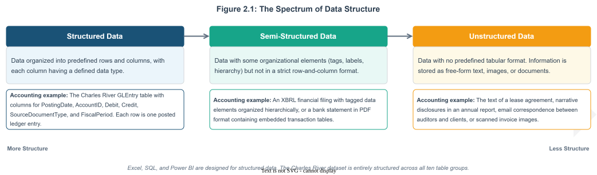
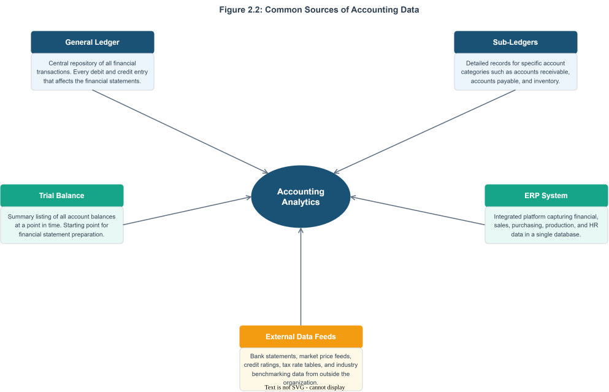
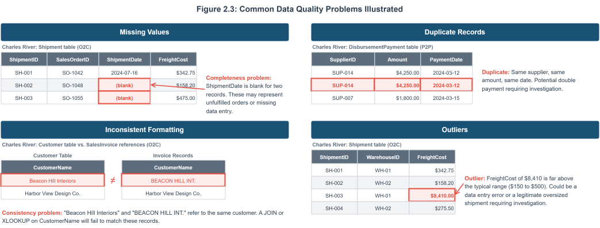
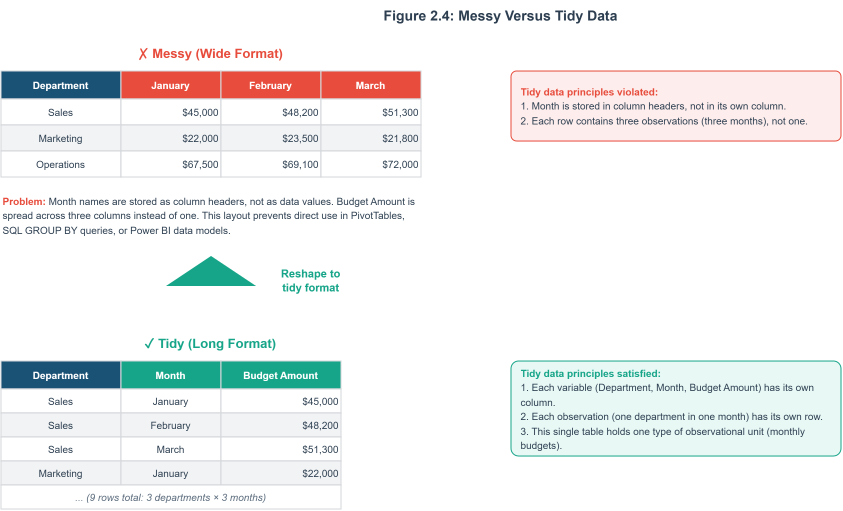
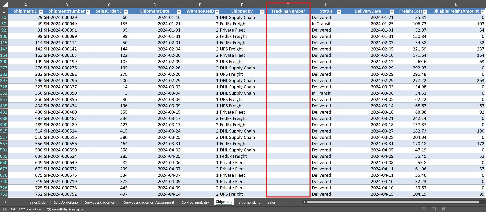

::: {.learning-objectives}
## Learning Objectives {.unnumbered}

After completing this chapter, you will be able to:

1. Distinguish between quantitative and qualitative data and between structured and unstructured data, and identify examples of each in accounting contexts.
2. Describe the primary sources of accounting data, including general ledgers, sub-ledgers, trial balances, enterprise resource planning systems, and external data feeds.
3. Evaluate accounting data against four quality dimensions: accuracy, completeness, consistency, and timeliness.
4. Explain the concept of tidy data and why it matters for accounting analytics.
5. Identify common data quality problems in the Charles River O2C and Accounting Core tables, including missing values, duplicates, inconsistent formatting, and outliers.
6. Trace how operational transactions in the Charles River dataset flow from source documents into the general ledger through the process-to-ledger traceability fields in GLEntry.
:::

## Opening Scenario {.unnumbered}

You are a newly hired internal auditor at Charles River, a mid-size home furnishings company that sells furniture, lighting, textiles, and decorative accessories through wholesale and direct-to-business channels. Your supervisor has asked you to assess the quality of the company's accounting data before the team begins the year-end audit. You start by opening the Charles River Excel workbook and examining the Order-to-Cash tables. In the Customer table, you notice that a few customer names appear under slightly different spellings. In the Shipment table, several records have no ShipmentDate value, leaving you uncertain whether those orders were ever fulfilled. You then turn to the Accounting Core tables. In the GLEntry table, you spot a handful of entries that reference account codes not found in the Account table. Before the audit team can run analytical procedures on revenue, test for duplicate payments, or evaluate journal entries for signs of management override, someone needs to determine whether the underlying data is reliable. Your supervisor has asked you to prepare that assessment. This chapter will give you the vocabulary, the framework, and the practical skills to evaluate whether accounting data is fit for analysis.

## Why Data Quality Comes First

Chapter 1 introduced the six-stage accounting analytics workflow, beginning with defining the question and ending with communicating findings. This chapter focuses on a concern that cuts across every stage of that workflow: the quality of the underlying data. No analytical technique, no matter how sophisticated, can produce reliable results if the data it operates on contains errors, gaps, or inconsistencies. A PivotTable built on revenue data with missing transaction dates will produce period totals that understate actual performance. A SQL query designed to detect duplicate payments will miss duplicates if vendor names are recorded inconsistently across tables. A Power BI dashboard showing budget-versus-actual comparisons will mislead managers if the budget data and the actual data use different account classifications.

The principle is straightforward. The quality of every analytical output is constrained by the quality of the data that feeds it. Researchers in information systems have formalized this idea by studying data quality as a measurable property of datasets, with dimensions that can be assessed, monitored, and improved (Wang and Strong, 1996). For accountants, data quality is not an abstract concern. It is a professional responsibility. Auditing standards require auditors to evaluate the reliability of data used in analytical procedures. Management accountants who present cost analyses to executives are implicitly vouching for the integrity of the numbers. Financial reporting analysts who prepare disclosures from database extracts must ensure that the underlying data supports the figures reported. Understanding what data quality means, how to assess it, and what problems to look for is therefore a prerequisite for everything else in this textbook.

## Data Types in Accounting

Before you can evaluate the quality of a dataset, you need to understand the types of data it contains. Accounting data takes many forms, and the appropriate way to store, analyze, and interpret a piece of data depends on what type it is. Two classification schemes are particularly useful for accounting analytics: the distinction between quantitative and qualitative data, and the distinction between structured and unstructured data.

### Quantitative and Qualitative Data

Quantitative data consists of values that represent measurements or counts and that can be meaningfully subjected to arithmetic operations. In accounting, the most familiar quantitative data includes transaction amounts (debits, credits, invoice totals, payment amounts), quantities (units produced, units sold, units in inventory), and calculated values (ratios, percentages, variances). Quantitative data can be further divided into continuous data, which can take any value within a range (such as a transaction amount of $1,247.83), and discrete data, which takes only specific values (such as the number of journal entries posted in a given month).

Qualitative data consists of values that represent categories, labels, or descriptions rather than measurements. In accounting, qualitative data includes account names, customer names, vendor classifications, transaction descriptions, product categories, and status codes such as "Closed" or "Open." Qualitative data can be nominal, meaning the categories have no natural order (such as the names of cost centers), or ordinal, meaning the categories have a meaningful sequence (such as a credit rating scale from AAA to D).

The distinction matters because it determines which analytical techniques are appropriate. You can calculate an average transaction amount, but you cannot calculate an average account name. You can count the number of transactions in each product category, but the category labels themselves are not quantities. Many data quality problems arise when qualitative data is treated as quantitative or when quantitative data is stored in a format that prevents arithmetic operations. A common example is a transaction amount stored as text rather than as a number because the original data source included a currency symbol or a comma in the value. The number looks correct to a human reader, but Excel and SQL cannot perform calculations on it until the formatting is corrected.

**Table 2.1: Examples of Quantitative and Qualitative Data in Accounting**

| Data Type | Subtype | Accounting Example | Typical Source |
|---|---|---|---|
| Quantitative | Continuous | Sales invoice line amount | SalesInvoiceLine (O2C group) |
| Quantitative | Continuous | Standard cost of a product ($18.50) | Item.StandardCost (Master Data group) |
| Quantitative | Continuous | Freight cost on a shipment ($342.75) | Shipment.FreightCost (O2C group) |
| Quantitative | Discrete | Number of units ordered on a sales line (350 units) | SalesOrderLine.OrderedQuantity (O2C group) |
| Quantitative | Discrete | Number of GLEntry rows posted in a fiscal period (412) | GLEntry (Accounting Core group) |
| Qualitative | Nominal | Account name ("Office Supplies Expense") | Account.AccountName (Accounting Core group) |
| Qualitative | Nominal | Customer name ("Beacon Hill Interiors") | Customer.CustomerName (O2C group) |
| Qualitative | Nominal | Item group classification ("Furniture") | Item.ItemGroup (Master Data group) |
| Qualitative | Nominal | Source document type ("SalesInvoice") | GLEntry.SourceDocumentType (Accounting Core group) |
| Qualitative | Ordinal | Supplier risk rating (Low, Medium, High) | Supplier.SupplierRiskRating (P2P group) |
| Qualitative | Ordinal | Sales order status (Open, Shipped, Closed) | SalesOrder.Status (O2C group) |

### Structured and Unstructured Data

A second important distinction is between structured and unstructured data. Structured data is organized into a predefined format, typically rows and columns in a table, where each column has a defined data type and each row represents a single observation or transaction. The Charles River dataset used in this textbook contains structured data throughout its 77 tables. The SalesOrder table, for example, has columns for SalesOrderID, CustomerID, OrderDate, RequestedDeliveryDate, and Status, and each row represents one customer order. Structured data is the primary input for the analytical techniques covered in this book, including PivotTables in Excel, SQL queries, and Power BI data models.

Unstructured data lacks a predefined tabular format. In accounting, unstructured data includes the text of contracts, the narrative sections of annual reports, email correspondence between auditors and clients, scanned images of invoices, and the notes that accountants attach to journal entries. Unstructured data often contains valuable information, but extracting that information requires different tools and techniques than those used for structured data. Natural language processing, a branch of artificial intelligence, is increasingly used to analyze unstructured accounting documents such as lease agreements and regulatory filings (Fisher, Garnsey, and Hughes, 2016). Chapter 20 discusses these emerging technologies in more detail.

Between these two extremes lies semi-structured data, which has some organizational elements but does not fit neatly into rows and columns. An example relevant to accounting is an XBRL (eXtensible Business Reporting Language) filing, which contains financial data tagged with standardized labels but organized in a hierarchical rather than tabular structure. Another example is a bank statement in PDF format that contains tabular transaction data embedded within an unstructured document layout.

{#fig-02-01 fig-alt="A horizontal diagram showing three zones from left to right: Structured Data (example: the Charles River GLEntry table with defined columns for PostingDate, AccountID, Debit, and Credit), Semi-Structured Data (example: an XBRL filing with tagged financial elements), and Unstructured Data (example: a contract document in plain text). Each zone includes a brief description and an accounting example."}

::: {.callout-tip .in-practice icon=false}
## In Practice
Most of the data that accountants work with in practice is structured. General ledgers, trial balances, accounts receivable aging schedules, and payroll registers are all structured datasets stored in rows and columns within ERP systems or accounting software. However, the proportion of unstructured data in accounting work is growing as firms adopt tools for contract analysis, disclosure review, and automated document processing. Developing strong skills with structured data, as this textbook teaches, provides the foundation for working with less structured data as your career progresses.
:::

This textbook focuses almost entirely on structured data because it represents the majority of what accountants analyze and because the tools covered here (Excel, SQL, and Power BI) are designed for structured datasets. The Charles River database is entirely structured, with clearly defined tables, columns, and data types across all ten table groups. Understanding this foundation is essential before you can evaluate whether a dataset is ready for analysis.

## Sources of Accounting Data

Accounting data originates from many places within and outside an organization. Understanding where data comes from helps you anticipate its strengths and limitations, which in turn helps you assess its quality and suitability for a given analytical task. This section describes the most common sources of accounting data that you will encounter in practice.

### The General Ledger and Sub-Ledgers

The general ledger is the central repository of an organization's financial transactions. Every debit and credit entry that affects the financial statements passes through the general ledger. In a database environment, the general ledger is typically stored as a table where each row represents one side of a journal entry (a single debit or credit), and columns record the posting date, the account number, the amount, a description, and a reference to the source document. The Charles River dataset stores its general ledger in the GLEntry table, which includes columns for GLEntryID, PostingDate, AccountID, Debit, Credit, SourceDocumentType, SourceDocumentID, VoucherType, VoucherNumber, FiscalYear, FiscalPeriod, and CostCenterID.

Sub-ledgers provide detailed records for specific account categories. The accounts receivable sub-ledger, for example, contains individual customer balances and the invoices and payments that make up each balance. The accounts payable sub-ledger contains individual vendor balances. The inventory sub-ledger contains records of individual stock items, their quantities, and their costs. Sub-ledgers feed summary totals to the general ledger, and the balances in the two should agree. When they do not, the discrepancy becomes an audit finding. In the Charles River dataset, the O2C table group (SalesOrder, SalesOrderLine, Shipment, SalesInvoice, CashReceipt) functions as a sales sub-ledger, recording individual transactions at a level of detail that the GLEntry summary does not capture.

### Trial Balances

A trial balance is a listing of all general ledger account balances at a specific point in time. It serves as a control to verify that total debits equal total credits and as the starting point for preparing financial statements. In an analytics context, the trial balance is useful as a summary dataset that provides a high-level view of the organization's financial position. Auditors frequently use the trial balance as the population from which they select accounts for testing. The trial balance is not a separate table in most databases but rather a report generated by summing the general ledger entries for each account.

### Enterprise Resource Planning Systems

An enterprise resource planning system integrates data from across an organization's functional areas into a single database. A typical ERP system captures not only financial transactions but also sales orders, purchase orders, production schedules, inventory movements, human resources records, and customer relationship management data. This integration means that an accountant with access to the ERP database can trace a sales transaction from the customer order through the shipment, the invoice, the revenue recognition entry in the general ledger, and the cash receipt. The Charles River dataset simulates this integrated environment, with 77 tables spanning ten table groups that cover the full cycle from sales orders and purchase orders through shipments, invoicing, cash receipts, manufacturing, payroll, and general ledger entries.

ERP systems are the dominant data source in large and mid-size organizations. They produce structured data with defined fields, data types, and validation rules. However, ERP data is not immune to quality problems. Data entry errors, system configuration mistakes, and gaps in validation rules can all introduce inaccuracies that propagate through the system. One of the advantages of the analytical skills taught in this textbook is the ability to identify these problems by examining the data directly rather than relying solely on the reports the ERP system generates (Grabski, Leech, and Schmidt, 2011).

{#fig-02-02 fig-alt="A diagram showing five data sources (General Ledger, Sub-Ledgers, Trial Balance, ERP System, and External Feeds) connected by arrows to a central box labeled Accounting Analytics. Each source box includes a one-sentence description of the type of data it provides."}

Accountants also work with data that originates outside the organization. External data sources include bank statements used for cash reconciliation, market price feeds used for fair value measurements, credit rating data used for impairment assessments, tax rate tables used for compliance calculations, and industry benchmarking data used for comparative analysis. External data introduces additional quality concerns because the accountant has less control over how the data was collected, formatted, and maintained. When external data is combined with internal data for analysis, differences in formatting, time periods, or classification schemes can create inconsistencies that must be resolved before the analysis can proceed.

::: {.callout-note .conection-dots icon=false}
## Connecting the Dots
In Chapter 5, you will use Excel lookup functions and Power Query to merge data from different Charles River tables, such as combining SalesOrder data with Customer details from a separate worksheet. The challenges you encounter in that chapter, including mismatched identifiers and inconsistent formatting, are practical examples of the data quality issues discussed here. Understanding the sources of accounting data now will help you anticipate those challenges when you begin working with the tools.
:::

## Data Quality Dimensions

Data quality is not a single characteristic that data either has or lacks. Researchers have identified multiple dimensions of data quality, each describing a different aspect of what makes data fit for its intended use. The framework developed by Wang and Strong (1996) identified more than a dozen dimensions, but four are particularly important for accounting analytics: accuracy, completeness, consistency, and timeliness. These four dimensions provide a practical vocabulary for describing data problems and assessing whether a dataset is suitable for a given analytical task.

### Accuracy

Accuracy means that the recorded values correspond to the true values they are intended to represent. A transaction amount of $5,000 is accurate if the actual transaction was indeed $5,000. An account classification of "Asset" in the Account.AccountType column is accurate if the account genuinely meets the definition of an asset under the applicable accounting standards. Accuracy is the most fundamental quality dimension because inaccurate data leads directly to incorrect analytical results.

In accounting datasets, accuracy problems arise from data entry errors (typing $50,000 instead of $5,000), calculation errors (applying the wrong exchange rate to a foreign currency transaction), classification errors (posting an expense to the wrong account), and measurement errors (using an incorrect cost allocation formula). Some accuracy problems are obvious when you inspect the data, such as a negative value in a field that should always be positive. Others are subtle and can only be detected by comparing the data to an independent source or by applying analytical tests such as reasonableness checks.

### Completeness

Completeness means that all expected data values are present. A dataset is complete if it contains all the records that should be there and if every field within each record has a value where one is expected. Completeness problems take two forms. The first is missing records, where entire transactions or entities are absent from the dataset. The second is missing values, where individual fields within existing records are blank or null.

In accounting, completeness is a significant concern for both preparers and auditors. A revenue dataset that is missing the last three days of the fiscal period will understate total revenue. An accounts payable listing that omits recently recorded invoices will understate total liabilities. Auditors specifically test for completeness because management has an incentive to understate liabilities and overstate assets, and missing data can serve that purpose either intentionally or accidentally. In the Charles River dataset, you will discover that some records in the Shipment table have missing or late ShipmentDate values, which raises the question of whether those orders were fulfilled on time or at all.

### Consistency

Consistency means that the same fact is represented in the same way wherever it appears. A customer named "Beacon Hill Interiors" in the Customer table should not appear as "BEACON HILL INT." in the SalesOrder table and "Beacon Hill Interiors, LLC" in the CashReceipt records. An account coded as "4100" in the Account table should be coded as "4100" everywhere it is referenced in the GLEntry table, not as "4100.0" in some entries and "41-00" in others.

Consistency problems are among the most common data quality issues in accounting datasets, and they are particularly troublesome because they can cause analytical results to be silently wrong rather than obviously wrong. If a SQL query groups revenue by customer name and the same customer appears under three different name variations, the query will produce three separate line items instead of one. The total revenue figure will be correct, but the per-customer breakdown will be misleading. Consistency problems are especially prevalent when data comes from multiple sources or when an organization has undergone a system migration (Redman, 2001).

### Timeliness

Timeliness means that the data reflects the current state of the business as of the relevant reporting date. A balance sheet analysis performed on general ledger data that has not been updated to include the final adjusting entries of the period will produce inaccurate results. A receivables aging analysis based on data that is two weeks old may overstate the number of delinquent accounts if payments have been received in the interim.

Timeliness is a quality dimension that depends on context. Data that is perfectly timely for a monthly management report may be inadequate for a daily cash position analysis. The analytical question determines what level of timeliness is required. Accountants must assess whether the data they are working with is current enough for the purpose at hand and, if it is not, either obtain more current data or disclose the limitation in their analysis.

**Table 2.2: The Four Data Quality Dimensions with Accounting Examples**

| Dimension | Definition | Accounting Example of a Problem (Charles River Context) |
|---|---|---|
| Accuracy | Recorded values correspond to the true values they are intended to represent. | A GLEntry record posts a debit of $50,000 when the source SalesInvoice shows $5,000. The extra zero is a data entry error that overstates the account balance by $45,000. |
| Completeness | All expected records and field values are present in the dataset. | Twenty-one records in the Shipment table have no value in the ShipmentDate column. These missing dates make it impossible to determine whether those orders were fulfilled or when shipment occurred, and they will be excluded from any analysis that filters by date. |
| Consistency | The same fact is represented in the same way wherever it appears in the dataset or across related datasets. | A customer is recorded as "Beacon Hill Interiors" in the Customer table but appears as "BEACON HILL INT." in SalesInvoice references. A query joining invoices to customers by name will fail to connect these records, splitting the customer's transaction history. |
| Timeliness | The data reflects the current state of the business as of the relevant reporting date. | An auditor performs a receivables aging analysis using GLEntry data extracted on March 1, but Charles River posted $200,000 in CashReceipt records on February 28 that are not reflected in the extract. The aging analysis overstates overdue balances. |

::: {.callout-warning .watch-out icon=false}
## WATCH OUT 
A dataset can score well on one quality dimension while failing on another. The general ledger may be perfectly accurate (every amount matches the source document) and perfectly consistent (every account code follows the same format) but incomplete because transactions from a subsidiary were not yet consolidated. Evaluating data quality requires examining all four dimensions, not just the one that is easiest to check.
:::

## Common Data Quality Problems in Accounting Datasets

The four quality dimensions provide a framework for thinking about data quality, but in practice, accountants encounter specific types of problems that recur across organizations and systems. Learning to recognize these problems is the first step toward resolving them. This section describes the most common data quality problems you will encounter when working with accounting data.

### Missing Values

Missing values occur when a field that should contain data is blank, null, or contains a placeholder such as "N/A" or "TBD." In accounting datasets, missing values often appear in date fields (a shipment date that was never recorded), in descriptive fields (a journal entry with no description), and in classification fields (a transaction that was never assigned to a cost center). Missing values can affect analysis in several ways. Some analytical tools exclude records with missing values from calculations, which can distort totals and averages. Other tools treat missing values as zeros, which produces a different type of distortion.

### Duplicate Records

Duplicate records occur when the same transaction, entity, or event appears more than once in a dataset. In accounts payable, a duplicate payment means the organization paid the same invoice twice. In a customer master file, a duplicate customer record means the same customer has two identities in the system, which splits their transaction history and makes it difficult to assess total purchasing volume or outstanding receivables. Duplicates can result from data entry errors, system integration problems, or the failure of validation controls. Detecting duplicates is an important audit analytics procedure, and you will perform duplicate detection exercises in several chapters of this textbook.

### Inconsistent Formatting

Inconsistent formatting occurs when the same type of data is recorded in different formats across records or across tables. Date formatting is a frequent source of inconsistency. One table may store dates as "2024-03-15" while another stores them as "03/15/2024" or "15-Mar-2024." Name formatting is another common issue. Customer names may appear with or without legal suffixes ("Inc.", "LLC"), with different capitalization, or with abbreviated words. Currency amounts may include or exclude currency symbols, and numeric values may use commas or periods as decimal separators depending on regional settings.

Inconsistent formatting is more than a cosmetic problem. When data from two tables must be matched or merged, formatting differences can prevent correct joins and lookups. An XLOOKUP formula in Excel or a JOIN clause in SQL that matches on customer name will fail to connect records if the name is spelled differently in the two tables. Chapters 5 and 10 of this textbook teach specific techniques for standardizing formatted data before analysis.

### Outliers

Outliers are values that fall far outside the expected range for a given field. A single invoice for $2,000,000 in a dataset where the average invoice is $5,000 may be a legitimate large transaction, or it may be a data entry error where extra zeros were added accidentally. A journal entry posted at 3:00 AM may be a legitimate automated posting, or it may indicate unauthorized activity. Outliers require investigation rather than automatic removal. The appropriate response depends on the context and on the accountant's professional judgment.

In audit analytics, outliers are often the transactions of greatest interest. Auditors look for unusual transactions because they may indicate errors, fraud, or control failures. The statistical and analytical techniques covered in later chapters, including stratification in Chapter 6, Benford's Law analysis in Chapter 8, and anomaly detection queries in Chapter 12, are all designed to help you identify and evaluate outliers systematically.

{#fig-02-03 fig-alt="A four-panel diagram with one panel for each problem type (Missing Values, Duplicates, Inconsistent Formatting, Outliers). Each panel shows a small sample of Charles River O2C data with the problem highlighted and a brief annotation explaining what is wrong."}

::: {.callout-tip .in-practice icon=false}
## IN PRACTICE
In professional practice, data quality assessment is often the first task in any analytics engagement. Audit teams perform data quality checks before running analytical procedures to ensure that the results will be reliable. Management accountants validate the data behind cost reports before presenting them to executives. The AICPA's Guide to Audit Data Analytics recommends that auditors evaluate the completeness and accuracy of data obtained from client systems before using it in substantive procedures (AICPA, 2017). The data quality skills you develop in this chapter apply directly to that professional requirement.
:::

## The Concept of Tidy Data

In 2014, the statistician Hadley Wickham published a paper that formalized a set of principles for organizing datasets in a way that makes them easy to analyze. He called datasets that follow these principles "tidy" and those that violate them "messy" (Wickham, 2014). The concept of tidy data has since become widely adopted in data analysis across many fields, and it is directly relevant to accounting analytics.

A tidy dataset has three properties. First, each variable occupies its own column. A variable is any attribute that is measured or recorded, such as transaction date, account number, or debit amount. Second, each observation occupies its own row. An observation is a single instance of what is being measured, such as one line item in a journal entry or one sales transaction. Third, each type of observational unit forms its own table. Customer information belongs in a customer table, order information belongs in an order table, and product information belongs in a product table.

These principles may seem obvious, but violations are surprisingly common in accounting data. A frequent violation is storing multiple variables in a single column. For example, a spreadsheet might have a column called "Account" that contains entries like "4100-Sales-Domestic" where the account number, account name, and geographic segment are all packed into one field. Analyzing sales by geographic segment requires splitting this column into three separate columns before any aggregation can be performed.

Another common violation is storing observations in column headers rather than in rows. A budget spreadsheet might have columns labeled "January," "February," "March," and so on, with each row representing a department and the values representing that department's budgeted amount for each month. This layout is easy for humans to read but difficult for analytical tools to process. A tidy version of the same data would have three columns (Department, Month, and Budget Amount) with one row for each department-month combination. This format, sometimes called "long" format as opposed to the "wide" format of the original, is what PivotTables, SQL GROUP BY queries, and Power BI data models require.

{#fig-02-04 fig-alt="Side-by-side comparison showing the same budget data in two layouts. The left panel shows the wide format with months as column headers (messy). The right panel shows the long format with Department, Month, and Budget Amount as columns (tidy). Annotations explain why the tidy format is preferred for analysis."}

::: {.callout-warning .watch-out icon=false}
## WATCH OUT
Students sometimes confuse "tidy" with "clean." A tidy dataset is one that follows the structural principles described above: each variable in its own column, each observation in its own row, each type of observational unit in its own table. A clean dataset is one that is free of quality problems such as missing values, duplicates, and inconsistencies. A dataset can be tidy but dirty (properly structured but containing errors) or clean but messy (free of errors but organized in a way that makes analysis difficult). Both structure and quality must be addressed before analysis can proceed.
:::

The Charles River dataset is, for the most part, already tidy. It is stored as relational database tables where each column represents a single variable and each row represents a single observation. This is by design: relational databases enforce the structural principles of tidy data because their table definitions require each column to have a name, a data type, and a single purpose. When you import the Charles River data into Excel, however, you may encounter situations where summary reports need to be restructured, particularly when working with budget data from the Organizational Planning tables that was designed for human readers rather than analytical tools. Chapter 5 introduces Power Query, which provides a systematic way to reshape data from messy to tidy formats.

::: {.callout-note .connecting-dots icon=false}
## CONNECTING THE DOTS
The tidy data principles described here are closely related to the concept of database normalization, which you will study in Chapter 3. Both tidy data and normalization seek to organize data so that each fact is stored once, in a single defined location, with no redundancy or ambiguity. Understanding tidy data now will make the transition to relational database concepts in the next chapter feel natural.
:::

## Process-to-Ledger Traceability

One of the most important features of the Charles River dataset is its process-to-ledger traceability. Every entry in the GLEntry table includes three columns that allow an analyst to trace the entry back to the operational document that created it: SourceDocumentType, SourceDocumentID, and SourceLineID. The SourceDocumentType column contains a text label identifying the type of business event, such as "SalesInvoice," "PurchaseInvoice," "JournalEntry," "PayrollRegister," or "WorkOrderClose." The SourceDocumentID column contains the primary key of the originating document, and the SourceLineID column identifies the specific line within that document.

This traceability structure means that an accountant examining a revenue entry in the general ledger can follow it back through the SalesInvoice that created it, through the Shipment that fulfilled the order, and all the way back to the original SalesOrder placed by the customer. An auditor examining a payroll expense entry can trace it to the specific PayrollRegister that generated it. A cost analyst examining a manufacturing overhead entry can trace it to the WorkOrderClose record that triggered the posting.

The ability to move between the general ledger and the operational documents that feed it is essential for effective accounting analytics. In real ERP systems, this traceability is what allows auditors to test individual transactions, allows financial analysts to investigate unusual account balances, and allows management accountants to explain cost variances. The Charles River dataset preserves this traceability by design, and you will use it extensively in the audit analytics exercises in Chapter 8 and the SQL-based investigation procedures in Chapter 12.

::: {.callout-note .connecting-dots icon=false}
## CONNECTING THE DOTS
In Chapters 8 and 12, you will use SQL to query the SourceDocumentType column in GLEntry to isolate journal entries made by the accounting team from entries generated automatically by sales invoices, purchase invoices, and payroll. The traceability structure you learned here is the foundation for those audit analytics procedures.
:::

## Mapping the Charles River Table Groups to Real-World Data Sources

The Charles River dataset is organized into ten table groups, and understanding how these groups map to real-world data environments will help you apply the concepts from this chapter in professional practice. The table groups fall into three levels of complexity that correspond to different types of data an accountant encounters in a real organization.

The first level consists of simple reference tables that store relatively static information. The Master Data group (Item, Warehouse, Employee) and the Organizational Planning group (CostCenter, Budget, BudgetLine) correspond to the configuration and planning data that an organization maintains as the foundation for its transactional systems. In a real company, these tables would be set up during system implementation and updated infrequently. Data quality problems in reference tables tend to involve completeness (a missing cost center assignment) and consistency (a department name that differs between the budget system and the general ledger).

The second level consists of transactional cycle tables that record high-volume business activity. The Order-to-Cash group (22 tables from Customer through CashReceiptApplication), the Procure-to-Pay group (9 tables from Supplier through DisbursementPayment), the Manufacturing group (14 tables from BillOfMaterial through WorkOrderClose), and the Payroll and Time group (14 tables from ShiftDefinition through PayrollLiabilityRemittance) correspond to the operational modules of an ERP system. In a real company, these tables accumulate thousands of records per month and are the primary source of the data quality problems discussed in this chapter: missing values in date and status fields, duplicate transactions from system integration errors, inconsistent formatting of names and codes, and outlier amounts from data entry mistakes. The Fixed Assets and Financing group (4 tables) and the Demand Planning and MRP group (5 tables) also fall into this transactional level, supporting capital asset management and production planning respectively.

The third level is the Accounting Core group (Account, JournalEntry, GLEntry), which corresponds to the general ledger and journal system where all business cycles converge. In a real company, the general ledger is the single source of truth for the organization's financial position. Every sales invoice, purchase invoice, payroll register, and manual journal entry ultimately creates entries in GLEntry. The data quality stakes are highest at this level because errors in the general ledger flow directly into the financial statements. The traceability columns in GLEntry (SourceDocumentType, SourceDocumentID, SourceLineID) allow analysts to verify that ledger entries match their operational sources, which is a critical audit procedure.

**Table 2.3: Mapping Charles River Table Groups to Real-World Accounting Data Sources**

| Table Group | Tables | Real-World Equivalent | Primary Data Quality Challenges | Chapters Where Quality Issues Are Explored |
|---|---|---|---|---|
| Accounting Core | 3 | General ledger, chart of accounts, and journal entry system. The single source of truth for the organization's financial position. | Referential integrity between GLEntry.AccountID and Account. Completeness of postings across all source document types. Debit-credit balance across the full ledger. | 2, 3, 8, 11, 12, 17 |
| Order-to-Cash (O2C) | 22 | Sales order management, fulfillment, invoicing, cash receipts, pricing, commissions, and returns. Corresponds to a full revenue cycle module in a real ERP. | Missing shipment dates, inconsistent customer names across tables, orphaned order references, outlier freight amounts, pricing lineage gaps. | 2, 4, 5, 6, 8, 9, 10, 12 |
| Procure-to-Pay (P2P) | 9 | Purchasing, goods receipt, supplier invoicing, and vendor payment. Corresponds to a full purchasing cycle module. | Duplicate payment risk, inconsistent supplier names, missing goods receipt dates, three-way match exceptions. | 5, 8, 10, 12, 19 |
| Manufacturing | 14 | Production planning, bills of material, work orders, material issues, labor, and production completion. Corresponds to a manufacturing execution module. | Missing quantities in work order records, inconsistent cost records between production and accounting, incomplete work order closure. | 6, 7, 11, 12, 18 |
| Payroll and Time | 14 | Shift scheduling, time tracking, payroll calculation, payment, and liability remittance. Corresponds to a workforce management and payroll module. | Missing time clock entries, gaps in payroll periods, inconsistencies between labor time entries and payroll register amounts. | 8, 11, 12, 18 |
| Fixed Assets and Financing | 4 | Fixed asset register, lifecycle events, and note-payable amortization schedules. Corresponds to a fixed asset sub-ledger. | Incomplete depreciation schedules, missing disposal records, inconsistent asset classification. | 11, 17 |
| Master Data | 3 | Product catalog (Item), warehouse locations, and employee records. Shared reference tables used across all other groups. | Duplicate item entries, missing StandardCost or ListPrice values, items with ListPrice below StandardCost suggesting negative margins. | 2, 4, 5, 9 |
| Organizational Planning | 3 | Cost center hierarchy, budget headers, and monthly budget line allocations. Corresponds to management reporting configuration. | Tidy data violations in budget layouts, inconsistent cost center identifiers between BudgetLine and GLEntry. | 2, 7, 15, 18 |
| Demand Planning and MRP | 5 | Demand forecasts, inventory policies, supply plan recommendations, material requirements, and capacity planning. | Stale or superseded forecast records, missing safety stock parameters, recommendation status inconsistencies. | 18 |

Understanding these mappings helps you connect the exercises in this textbook to the data environments you will encounter after graduation. When you inspect the Charles River SalesOrder and Customer tables for quality problems in the tutorial that follows, you are practicing the same skills you would use when working with transaction exports from a client's order management system. When you assess the completeness and consistency of the GLEntry table, you are performing the same type of evaluation that an audit team performs at the start of every engagement.

## Guided Tutorial 2.1: Inspecting Charles River O2C Data for Data Quality Problems

**Context and objective.** In this tutorial, you will examine the Charles River O2C tables in Excel and identify specific data quality problems across several worksheets. The goal is to practice applying the four quality dimensions (accuracy, completeness, consistency, and timeliness) to a real dataset and to document what you find. This tutorial connects to the opening scenario by showing you how a data quality assessment works in practice.

**Prerequisites.** You need Microsoft Excel installed on your computer and access to the CharlesRiver.xlsx file provided with this textbook.

**Step-by-step instructions.**

**Step 1.** Open CharlesRiver.xlsx in Excel and click on the SalesOrder worksheet. Scroll across the columns to familiarize yourself with the available fields. You should see columns including SalesOrderID, OrderNumber, CustomerID, OrderDate, RequestedDeliveryDate, SalesRepEmployeeID, FreightTerms, and Status. Scroll down to get a sense of the number of records.

**Step 2.** Click on the Shipment worksheet. Examine the columns, which include ShipmentID, SalesOrderID, ShipmentDate, WarehouseID, FreightCost, BillableFreightAmount, and Status. Use the filter dropdown on the TrackingNumber column to look for blank cells. Count the number of shipment records that have no TrackingNumber value. These missing values represent a completeness problem: shipments that were created but for which no TrackingNumber was recorded. Record the count.

{#fig-02-05 fig-alt="Screenshot of the Charles River Shipment worksheet in Excel with the TrackingNumber column filtered to show blank cells. An annotation highlights the missing values and identifies this as a completeness problem."}

**Step 3.** Click on the Customer worksheet. Examine the Region column using the filter dropdown. Check for blank values. You will find that some customers have no value in the Region field. Consider whether this represents a true completeness problem (the data should exist but was not entered) or whether some customers were not assigned a region during setup. This distinction matters because the appropriate response differs. If the data should exist, it needs to be obtained. If the field was intentionally left blank, the gap is a known limitation rather than an error.

**Step 4.** Still on the Customer worksheet, examine the CustomerName column. Look for potential consistency problems by scanning for variations in how customer names are formatted. Sort the column alphabetically to make near-duplicates easier to spot. Check whether any customer names appear to be the same company recorded under slightly different names (such as differences in punctuation, abbreviation, or legal suffix).

**Step 5.** Return to the Shipment worksheet. Create a simple check for potential accuracy problems by examining the FreightCost column. Sort the FreightCost column from largest to smallest. Examine the highest values. Are any freight amounts unusually large relative to the others? Make a note of any values that appear to be outliers. In a real engagement, you would investigate these further to determine whether they are legitimate transactions or data entry errors.

**Step 6.** Examine the relationship between the SalesOrder.OrderDate and the Shipment.ShipmentDate. Because these values are in two different worksheets, you will need to bring them together. In the Shipment worksheet, add a new column and use an XLOOKUP or VLOOKUP formula to retrieve the OrderDate from the SalesOrder worksheet by matching on SalesOrderID. Then create a helper formula that returns "Check" if ShipmentDate is earlier than OrderDate, and "OK" otherwise. Copy the formula down the column and filter for any "Check" results. A shipment that predates its order would indicate a potential accuracy problem in the date fields.

*[Figure 2.6: Screenshot showing the Charles River Shipment worksheet with helper columns that retrieve the OrderDate from SalesOrder and flag records where ShipmentDate precedes OrderDate. The XLOOKUP formula is visible in the formula bar, and the annotation identifies this as an accuracy check.]*

**Step 7.** Click on the Item worksheet. Examine the StandardCost and ListPrice columns. Sort by ListPrice from smallest to largest. Check whether any items have a ListPrice of zero, which could indicate a missing value recorded as zero rather than left blank. Also compare StandardCost to ListPrice and identify any items where the ListPrice is less than the StandardCost, which would imply a negative margin and warrants investigation.

**Checkpoint.** At this point, you should have identified at least three specific data quality problems in the Charles River O2C tables: missing ShipmentDate values in the Shipment table (completeness), potential inconsistencies in customer names in the Customer table (consistency), and at least one finding worth investigating further in the date sequence or freight amounts (accuracy). You should have a written list of findings, noting the table, the column, the type of problem, and the number of affected records. This list is a simple version of the data quality assessment that auditors perform at the start of every analytics engagement.

## Guided Tutorial 2.2: Examining the Charles River Accounting Core for Completeness and Consistency

**Context and objective.** In this tutorial, you will examine the Charles River Accounting Core tables to assess whether the general ledger entries and chart of accounts are complete and consistent. This is a more accounting-specific data quality assessment than the O2C tutorial, because it involves checking whether the accounting records themselves are internally coherent. The skills practiced here connect directly to the audit procedures you will learn in Chapter 8 and Chapter 12.

**Prerequisites.** You need Microsoft Excel installed on your computer, access to the CharlesRiver.xlsx file, and completion of Tutorial 2.1.

**Step-by-step instructions.**

**Step 1.** Open CharlesRiver.xlsx in Excel (if not already open) and click on the Account worksheet. Examine the columns available. You should see fields including AccountID, AccountNumber, AccountName, AccountType, AccountSubType, and ParentAccountID. This is the chart of accounts for Charles River, and it forms the backbone of the Accounting Core. The ParentAccountID column creates a hierarchical structure that organizes accounts into groups. Scroll through the list to get a sense of how many accounts exist and how they are organized.

**Step 2.** Check the chart of accounts for completeness. Every major account type should be represented. Sort or filter the AccountType column and verify that the chart includes accounts classified as Asset, Liability, Equity, Revenue, and Expense. If any major category is missing, that is a completeness problem. Record your findings.

**Step 3.** Click on the GLEntry worksheet. Examine the columns available. You should see fields including GLEntryID, PostingDate, AccountID, Debit, Credit, SourceDocumentType, SourceDocumentID, SourceLineID, VoucherType, VoucherNumber, FiscalYear, FiscalPeriod, and CostCenterID. Scroll down to get a sense of the volume of data.

**Step 4.** Check the general ledger for a fundamental accounting consistency requirement: for every transaction, total debits should equal total credits. To test this at the aggregate level, use the SUM function to calculate the total of the Debit column and the total of the Credit column. The two totals should be equal, or very nearly so (small differences may arise from rounding). If there is a significant difference, that indicates a serious consistency problem in the ledger.

*[Figure 2.7: Screenshot of the Charles River GLEntry worksheet with SUM formulas calculating total debits and total credits at the bottom of the respective columns. An annotation highlights the comparison and explains that equal totals confirm the basic debit-equals-credit consistency of the ledger.]*

**Step 5.** Check for accounts referenced in the general ledger that do not exist in the chart of accounts. This is a consistency check between two related tables. To perform this check manually, use the COUNTIFS function. In a new column adjacent to the GLEntry data, enter a formula that counts how many times the AccountID value in the current GL row appears in the Account worksheet's AccountID column. If any GLEntry row returns a count of zero, that means the entry references an account that does not exist in the chart of accounts, which is a consistency problem. Scan for any zeros and record the affected entries.

**Step 6.** Examine the PostingDate column in the GLEntry worksheet. Sort by posting date and check the date range. Note the earliest and latest dates. Use the FiscalYear and FiscalPeriod columns to check whether entries are present for every period within the fiscal year. If any fiscal period has an unusually low number of entries compared to other periods, that could indicate missing transactions. Also check whether any entries have dates that fall outside the expected fiscal year, which would be an accuracy concern.

**Step 7.** Examine the Debit and Credit columns for missing or unusual values. Filter for rows where both the Debit and Credit fields are zero or blank. An entry with no debit and no credit amount serves no accounting purpose and may indicate a data entry error or a system artifact. Record the count of such entries if any exist.

**Step 8.** Examine the SourceDocumentType column. Use a PivotTable or COUNTIFS formulas to count the number of GLEntry rows for each source document type. You should see entries from types such as "SalesInvoice," "PurchaseInvoice," "JournalEntry," "PayrollRegister," and "WorkOrderClose." If any expected source type is absent, that could indicate a completeness problem where an entire business cycle failed to post to the ledger. Record the distribution of entries by source document type.

**Checkpoint.** At this point, you should have assessed the Charles River Accounting Core against three quality dimensions: completeness (all account types present in the chart of accounts, no gaps in fiscal periods, all expected source document types represented in GLEntry), consistency (debits equal credits in the aggregate, all GL account references exist in the chart of accounts), and accuracy (no entries outside the expected date range, no zero-amount entries without explanation). Your findings should be documented in a brief written summary that identifies each test performed, the result, and any issues discovered. This exercise previews the audit analytics work you will perform in Chapters 8 and 12, where you will use SQL to automate these same tests across the entire population.

## Looking Ahead

This chapter has provided the vocabulary and the framework you need to think critically about accounting data before you begin analyzing it. You can now distinguish between quantitative and qualitative data, between structured and unstructured data, and between data that is tidy and data that needs restructuring. You know the primary sources of accounting data and the four dimensions against which data quality is measured. You understand how the Charles River table groups map to real-world data environments and how the process-to-ledger traceability in GLEntry connects operational activity to the posted ledger. You have practiced inspecting the O2C and Accounting Core tables for specific quality problems and documenting your findings.

In the next chapter, you will build on this foundation by studying how accounting data is organized within relational databases. Chapter 3 introduces the concepts of tables, keys, and relationships that make it possible to connect data across different parts of an accounting system. Understanding these structures will prepare you for the SQL chapters in Part III and for the data modeling work you will do in Power BI in Part IV.

## Chapter Summary

Every accounting analytics project depends on the quality of the data that feeds it. Before applying any analytical technique, accountants must understand what types of data they are working with, where the data came from, and whether it is fit for the intended purpose. This chapter established the conceptual foundation for that assessment.

Accounting data can be classified along two dimensions. The quantitative versus qualitative distinction determines whether arithmetic operations are appropriate. The structured versus unstructured distinction determines which analytical tools can be applied. The Charles River dataset contains structured data organized in rows and columns across 77 tables, which is the format required by Excel, SQL, and Power BI. Accounting data originates from general ledgers, sub-ledgers, trial balances, enterprise resource planning systems, and external sources. Each source has characteristic strengths and limitations that affect data quality.

Data quality is assessed along four dimensions: accuracy, completeness, consistency, and timeliness. Accuracy means that recorded values correspond to true values. Completeness means that all expected records and fields are present. Consistency means that the same fact is represented the same way wherever it appears. Timeliness means that the data reflects the relevant reporting period. Common data quality problems include missing values, duplicate records, inconsistent formatting, and outliers. Each of these problems can distort analytical results if not identified and addressed before analysis begins.

The concept of tidy data provides a structural standard for how datasets should be organized: each variable in its own column, each observation in its own row, and each type of observational unit in its own table. Tidy data is easier to analyze than messy data because it aligns with the input requirements of PivotTables, SQL queries, and Power BI data models. The Charles River dataset follows tidy principles because it is stored as relational database tables, but real-world data often requires restructuring before it reaches this standard.

The practical skills introduced in the two guided tutorials, inspecting the Charles River O2C tables for missing values, date inconsistencies, and outliers, and examining the Accounting Core for completeness and consistency, represent the first steps in a data quality assessment process that you will apply throughout this textbook and throughout your career. The process-to-ledger traceability built into the GLEntry table, with its SourceDocumentType, SourceDocumentID, and SourceLineID columns, provides the foundation for tracing any ledger entry back to the business event that created it, a skill that becomes central to the audit and financial reporting analytics in later chapters.



## Key Terms

**Accuracy.** A data quality dimension indicating that recorded values correspond to the true values they are intended to represent. In accounting, accuracy problems include data entry errors, misclassifications, and incorrect calculations.

**Completeness.** A data quality dimension indicating that all expected records and field values are present in the dataset. Missing transactions, blank fields, and omitted time periods are examples of completeness problems.

**Consistency.** A data quality dimension indicating that the same fact is represented in the same way wherever it appears in a dataset or across related datasets. Inconsistent customer names, account codes, or date formats are common consistency problems.

**Data quality.** The degree to which a dataset is fit for its intended use, assessed across multiple dimensions including accuracy, completeness, consistency, and timeliness.

**Duplicate record.** A record that appears more than once in a dataset, representing the same underlying transaction, entity, or event. Duplicate payments and duplicate customer entries are common examples in accounting data.

**External data.** Data originating from outside the organization, such as bank statements, market price feeds, credit ratings, and industry benchmarks. External data introduces additional quality concerns because the accountant has less control over how it was collected and formatted.

**General ledger.** The central repository of an organization's financial transactions, containing debit and credit entries organized by account. In the Charles River dataset, the general ledger is stored in the GLEntry table within the Accounting Core group.

**Missing value.** A field within a record that is blank, null, or contains a placeholder rather than a substantive value. Missing values represent a completeness problem and can distort calculations if not handled properly.

**Outlier.** A data value that falls far outside the expected range for its field. Outliers may represent legitimate unusual transactions or data entry errors and require investigation to determine the appropriate treatment.

**Process-to-ledger traceability.** The ability to trace any general ledger entry back to the operational document that created it, using the SourceDocumentType, SourceDocumentID, and SourceLineID columns in GLEntry. This traceability supports audit testing, variance investigation, and financial reporting verification.

**Qualitative data.** Data consisting of categories, labels, or descriptions rather than numerical measurements. Account names, transaction descriptions, and vendor classifications are examples of qualitative data in accounting.

**Quantitative data.** Data consisting of numerical values that represent measurements or counts and that can be subjected to arithmetic operations. Transaction amounts, unit quantities, and financial ratios are examples of quantitative data in accounting.

**Semi-structured data.** Data that has some organizational elements but does not fit neatly into rows and columns. XBRL filings and PDF bank statements are examples relevant to accounting.

**Structured data.** Data organized into a predefined format of rows and columns, where each column has a defined data type. The Charles River dataset contains structured data across all ten table groups.

**Sub-ledger.** A detailed record for a specific category of accounts that feeds summary totals to the general ledger. The accounts receivable sub-ledger and accounts payable sub-ledger are common examples. In the Charles River dataset, the O2C and P2P table groups function as sub-ledgers.

**Tidy data.** A dataset organized so that each variable occupies its own column, each observation occupies its own row, and each type of observational unit forms its own table. Tidy data aligns with the input requirements of analytical tools such as PivotTables, SQL, and Power BI.

**Timeliness.** A data quality dimension indicating that the data reflects the current state of the business as of the relevant reporting date. Data that is not current enough for the intended analysis has a timeliness problem.

**Unstructured data.** Data that lacks a predefined tabular format, such as the text of contracts, email correspondence, or scanned invoice images.



## Multiple Choice Questions

**1.** A transaction amount of $15,000 is recorded in the general ledger as $1,500 due to a data entry error. This is an example of a problem with which data quality dimension?

A. Completeness
B. Timeliness
C. Accuracy
D. Consistency

**2.** An auditor discovers that 21 records in the Charles River Shipment table have no value in the ShipmentDate field. This situation represents a problem with which data quality dimension?

A. Accuracy
B. Completeness
C. Consistency
D. Timeliness

**3.** Charles River's Customer table records a client as "Beacon Hill Interiors" while the SalesInvoice records list the same client as "BEACON HILL INT." An analyst attempting to match invoices to customer records will encounter errors because of this difference. This is an example of a problem with which data quality dimension?

A. Accuracy
B. Completeness
C. Consistency
D. Timeliness

**4.** Which of the following is an example of qualitative data in an accounting context?

A. The total amount of a sales invoice
B. The number of units of inventory on hand
C. The name of the cost center to which an expense is assigned
D. The gross profit margin expressed as a percentage

**5.** According to the concept of tidy data, a budget spreadsheet with months as column headers (January, February, March) and departments as rows is considered "messy" because it violates which tidy data principle?

A. Each variable should occupy its own column
B. Each observation should occupy its own row
C. Each type of observational unit should form its own table
D. Both A and B

**6.** An auditor is performing analytical procedures using general ledger data extracted from the client's ERP system on March 15 for a fiscal year ending December 31. The data includes all adjusting entries through March 10 but not the final three adjusting entries posted on March 12. This situation represents a concern about which data quality dimension?

A. Accuracy
B. Completeness
C. Consistency
D. Timeliness

**7.** Which of the following best describes the relationship between structured and unstructured data in accounting practice?

A. Accountants work exclusively with structured data and never encounter unstructured data.
B. Most accounting analytical work uses structured data, but the proportion of unstructured data in accounting is growing.
C. Unstructured data has replaced structured data as the primary input for accounting analytics.
D. Structured and unstructured data require the same analytical tools and techniques.

**8.** A management accountant discovers that the same product appears in the Item table under two different ItemID values because it was entered separately by two warehouse locations. This is an example of which data quality problem?

A. Missing value
B. Outlier
C. Duplicate record
D. Timeliness problem

**9.** Which of the following sources of accounting data provides the most complete picture of an organization's financial transactions?

A. The accounts receivable sub-ledger
B. The general ledger
C. An external bank statement
D. A product inventory listing

**10.** In the Charles River dataset, the GLEntry table includes a SourceDocumentType column. Which of the following best describes the purpose of this column?

A. It records the name of the employee who posted the entry.
B. It identifies the type of business event that generated the ledger entry, such as "SalesInvoice," "PurchaseInvoice," or "JournalEntry."
C. It stores the total amount of the transaction in a text format.
D. It indicates whether the entry has been approved by a supervisor.

**11.** A dataset is organized so that each variable occupies its own column and each observation occupies its own row, but several records contain data entry errors in the amount field. This dataset is best described as:

A. Tidy and clean
B. Tidy but not clean
C. Clean but not tidy
D. Neither tidy nor clean

**12.** A financial analyst creates a revenue summary using a SQL query that groups sales by customer name. The query returns 150 distinct customers, but the Charles River Customer table contains only 142 customer records. The most likely explanation for the discrepancy is:

A. The SQL query contains a syntax error.
B. Some customers made purchases but were never entered into the Customer table.
C. Inconsistent formatting of customer names caused the same customer to appear under multiple name variations.
D. The Customer table is more current than the sales data.

**13.** An enterprise resource planning system is distinct from a standalone accounting package primarily because an ERP system:

A. Uses a relational database to store data
B. Integrates data from multiple functional areas such as sales, production, purchasing, and human resources into a single database
C. Produces financial statements automatically
D. Eliminates all data quality problems through built-in validation rules

**14.** Which of the following best explains why data quality assessment should be performed before any analysis begins?

A. Software tools cannot process data that contains quality problems.
B. Data quality problems can cause analytical results to be unreliable or misleading, and identifying problems in advance allows the accountant to address them.
C. Professional standards prohibit accountants from using any data that contains missing values.
D. Data quality assessment is only required for auditing engagements and not for managerial accounting or financial reporting.

**15.** An auditor examining the Charles River GLEntry table uses the SourceDocumentType column to separate entries generated by SalesInvoice from entries generated by JournalEntry. This separation is most useful for which audit procedure?

A. Calculating the total revenue for the period
B. Identifying manual journal entries that may indicate management override of controls, as distinct from entries generated automatically by business transactions
C. Verifying that the general ledger is in a tidy data format
D. Confirming that all customers in the Customer table have placed at least one order



## Applied Exercises

### Financial Accounting Exercises

**Exercise 2.1 (Financial Accounting): Assessing Revenue Data Quality in the Charles River O2C Tables**

**Table group:** O2C

**Scenario.** You are a financial reporting analyst at Charles River preparing to analyze the company's revenue for the most recent fiscal year. Before building any reports, you need to verify that the underlying sales data is reliable enough to support accurate revenue figures.

**Requirements.** (1) Open the CharlesRiver.xlsx workbook in Excel and examine the SalesOrder, SalesOrderLine, SalesInvoice, SalesInvoiceLine, Customer, and Item worksheets. For each table, identify and document any data quality problems you observe, classifying each problem by quality dimension (accuracy, completeness, consistency, or timeliness). (2) Assess whether the SalesInvoiceLine table contains the information needed to calculate revenue for each invoice. Identify the columns involved and note any values that appear problematic (such as zero or negative line amounts, missing item references, or pricing methods that seem inconsistent). (3) Examine whether every CustomerID in the SalesOrder table corresponds to a customer in the Customer table. Use COUNTIFS or XLOOKUP to test this relationship. Document any orphaned records where an order references a customer that does not exist. (4) Prepare a brief written data quality assessment memorandum (one page) that summarizes your findings and recommends whether the data is suitable for revenue reporting or whether specific problems must be resolved first.

**Deliverable.** A one-page data quality assessment memorandum with specific findings organized by quality dimension.

**Exercise 2.2 (Financial Accounting): Evaluating General Ledger Completeness at Charles River**

**Table group:** Acct Core

**Scenario.** You are a financial reporting analyst who has been asked to verify that the Charles River general ledger is complete before the team begins preparing the year-end financial statements. Your supervisor is concerned that some transactions may not have been posted.

**Requirements.** (1) Open the CharlesRiver.xlsx workbook and examine the GLEntry worksheet. Calculate the total debits and total credits across all entries. Determine whether the ledger is in balance. (2) Identify the date range covered by the general ledger entries. Use the FiscalYear and FiscalPeriod columns to check whether entries are present for every period within the fiscal year. Note any periods that appear to have an unusually low number of entries compared to other periods, which could indicate missing transactions. (3) Examine the SourceDocumentType column to understand what types of transactions are recorded. Determine whether the ledger includes entries from all expected source types (such as SalesInvoice, PurchaseInvoice, JournalEntry, PayrollRegister, and WorkOrderClose). If any expected source type is absent, document this as a potential completeness concern. (4) Write a brief assessment (one page) of the general ledger's completeness, suitable for review by the financial reporting manager.

**Deliverable.** A one-page completeness assessment memorandum with quantitative evidence supporting each finding.

### Managerial Accounting Exercises

**Exercise 2.3 (Managerial Accounting): Data Quality Assessment for Product Cost Analysis**

**Table group:** Master Data and Manufacturing

**Scenario.** You are a cost analyst at Charles River who has been asked to perform a product cost analysis. Before starting the analysis, you need to assess whether the data is clean enough to produce reliable cost figures.

**Requirements.** (1) Open the CharlesRiver.xlsx workbook and examine the Item worksheet from the Master Data group. Identify any items where the StandardCost field is zero, blank, or appears unreasonable. Assess whether these entries represent data quality problems or legitimate situations (such as items that are services rather than physical products, which may have a StandardCost of zero by design). (2) Compare the StandardCost and ListPrice columns. Identify any items where the ListPrice is less than the StandardCost, which would imply a negative margin. Determine whether these represent accuracy problems or deliberate pricing decisions. Note the SupplyMode column (Purchased versus Manufactured), which may explain cost differences. (3) Examine the WorkOrder worksheet from the Manufacturing group. Check for missing values in key fields such as PlannedQuantity, status, and date fields. (4) Write a brief assessment (one half to one page) of the data's suitability for product cost analysis, identifying any problems that would need to be resolved before proceeding.

**Deliverable.** A written data quality assessment focused on cost analysis readiness, with specific item-level and work-order-level findings.

**Exercise 2.4 (Managerial Accounting): Identifying Tidy Data Problems in Budget Reports**

**Table group:** Org Planning

**Scenario.** You are a management accountant at Charles River who needs to compare budgeted amounts to actual spending by cost center. The budget data is available in the Organizational Planning tables, but you suspect it may not be in a format suitable for analysis.

**Requirements.** (1) Open the CharlesRiver.xlsx workbook and examine the Budget and BudgetLine worksheets from the Organizational Planning group. Examine the structure. Determine whether the budget data follows tidy data principles (each variable in its own column, each observation in its own row). If not, describe specifically which tidy data principle is violated and how the data would need to be restructured. (2) Examine the cost center references in the BudgetLine table and in the GLEntry table. The BudgetLine table references cost centers, and GLEntry includes a CostCenterID column. Assess whether the cost center identifiers are consistent between the two sources. Identify any inconsistencies that would prevent a straightforward comparison. (3) Document your findings in a brief memorandum (one half to one page) that recommends specific data preparation steps needed before a budget-versus-actual analysis can be performed.

**Deliverable.** A written memorandum identifying structural and quality issues in the budget data and recommending preparation steps.

### Auditing Exercises

**Exercise 2.5 (Auditing): Data Quality Evaluation for Audit Planning**

**Table group:** O2C, Acct Core, and P2P

**Scenario.** You are a first-year auditor assigned to evaluate the data that will be used for analytics procedures during the upcoming Charles River audit. Your senior has asked you to perform a preliminary data quality assessment across three table groups to determine which data sources are reliable enough for audit testing.

**Requirements.** (1) For the O2C table group, perform the following data quality checks: test for missing values in critical fields of the SalesOrder table (OrderDate, CustomerID, Status), test for records where Shipment.ShipmentDate precedes SalesOrder.OrderDate by matching on SalesOrderID, and check the Item table for items with zero or negative ListPrice values. Document the number of records affected by each problem. (2) For the Accounting Core group, perform the following checks: verify that total debits equal total credits in GLEntry, check for GLEntry records that reference an AccountID not found in the Account table, and examine the SourceDocumentType column for any unexpected or missing source types. (3) For the P2P group, examine the DisbursementPayment table and check for potential duplicate payments by sorting on SupplierID, Amount, and PaymentDate. Document any records that match on all three fields. (4) For each problem identified, classify it by quality dimension and assess its potential impact on audit procedures. A missing date, for example, would prevent the auditor from testing the transaction in the correct period. Prepare a one-page audit data quality assessment memorandum that your senior could use to decide which tables are suitable for audit analytics.

**Deliverable.** A one-page audit data quality assessment memorandum organized by table group and quality dimension.

**Exercise 2.6 (Auditing): Testing for Duplicate Payments**

**Table group:** P2P

**Scenario.** Your audit team has identified duplicate payments as a risk area for the current Charles River engagement. Before performing a full duplicate payment analysis (which you will learn in Chapter 12 using SQL), you have been asked to perform a preliminary manual check using Excel.

**Requirements.** (1) Open the CharlesRiver.xlsx workbook and examine the DisbursementPayment worksheet from the P2P table group. Identify the fields that would be relevant for detecting duplicate payments, such as SupplierID (as the payee identifier), Amount, and PaymentDate. (2) Sort the data by SupplierID and then by Amount to bring potential duplicates into adjacent rows. Scan for records where the same supplier received the same amount on the same date or within a narrow date range. Document any potential duplicates you identify. (3) Assess the reliability of your manual approach. Consider what limitations exist when searching for duplicates by visual inspection versus using automated techniques. Write two to three sentences explaining why a SQL-based approach (which you will learn in Chapter 12) would be more effective for this task. (4) Prepare a brief memorandum (one half page) documenting the potential duplicates identified and your assessment of the method's limitations.

**Deliverable.** A written memorandum documenting potential duplicate payments and the limitations of manual detection methods.



## Further Reading

Wang, R. Y., and Strong, D. M. (1996). Beyond accuracy: What data quality means to data consumers. *Journal of Management Information Systems*, 12(4), 5-33. This paper established the foundational framework for understanding data quality as a multidimensional concept defined by the needs of data users. The four quality dimensions discussed in this chapter (accuracy, completeness, consistency, and timeliness) draw on this framework, and the paper remains essential reading for anyone who works with data quality assessment in any professional context.

Wickham, H. (2014). Tidy data. *Journal of Statistical Software*, 59(10), 1-23. This paper formalized the principles of tidy data that are discussed in this chapter. Although the examples use the R programming language, the structural principles apply to any data analysis environment, including Excel, SQL, and Power BI. The paper's clear explanation of why each variable should occupy its own column and each observation its own row is directly relevant to the data preparation challenges students will encounter throughout this textbook.

Grabski, S. V., Leech, S. A., and Schmidt, P. J. (2011). A review of ERP research: A future agenda for accounting information systems. *Journal of Information Systems*, 25(1), 37-78. This review paper examines the research literature on enterprise resource planning systems and their implications for accounting. It provides useful context for understanding the role of ERP systems as data sources in accounting analytics and discusses the data quality challenges that arise within ERP environments.

Redman, T. C. (2001). *Data quality: The field guide.* Digital Press. This practitioner-oriented book provides a comprehensive treatment of data quality concepts, assessment methods, and improvement strategies. Although it addresses data quality broadly rather than in an accounting-specific context, the practical techniques it describes for identifying and resolving data quality problems are directly applicable to the exercises in this chapter and throughout the textbook.

AICPA (American Institute of Certified Public Accountants). (2017). *Guide to audit data analytics.* AICPA. This professional guidance document describes how auditors should use data analytics in audit engagements, including specific recommendations for evaluating the reliability and completeness of data before performing analytical procedures. The guide's discussion of data quality evaluation aligns with the quality dimensions covered in this chapter and supports the audit-oriented exercises throughout the textbook.

Fisher, I. E., Garnsey, M. R., and Hughes, M. E. (2016). Natural language processing in accounting, auditing and finance: A synthesis of the literature with a roadmap for future research. *Intelligent Systems in Accounting, Finance and Management*, 23(3), 157-214. This paper reviews the emerging application of natural language processing to unstructured accounting data such as contracts, disclosures, and regulatory filings. It provides useful context for the brief discussion of unstructured data in this chapter and points toward the emerging technologies covered in Chapter 20.

Bovee, M., Srivastava, R. P., and Mak, B. (2003). A conceptual framework and belief-function approach to assessing overall information quality. *International Journal of Intelligent Systems*, 18(1), 51-74. This paper presents a formal framework for assessing information quality that extends the foundational work of Wang and Strong. The paper's approach to evaluating quality dimensions is relevant to the data quality assessment exercises in this chapter, particularly for students interested in the theoretical underpinnings of data quality measurement.

Dai, J., and Vasarhelyi, M. A. (2017). Toward blockchain-based accounting and assurance. *Journal of Information Systems*, 31(3), 5-21. While this paper focuses primarily on blockchain technology, it includes a useful discussion of how data integrity and quality assurance are handled in current accounting information systems versus emerging distributed ledger approaches. It provides forward-looking context that connects the data quality concepts in this chapter to the emerging technologies discussed in Chapter 20.
