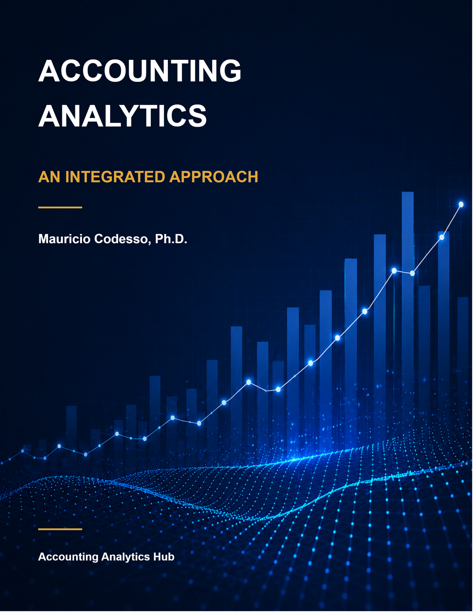

# Accounting Analytics: An Integrated Approach

**Mauricio Codesso**

Welcome to the repository for *Accounting Analytics: An Integrated Approach*, an
open educational resource. The book helps accounting students develop analytical
skills through accounting examples and applications using Excel, SQL, and Power BI.

**[Read the book online](https://aa.accountinganalyticshub.com/)**

The book website is the starting point for reading the chapters and finding
available book downloads and the companion dataset.

  

## For accounting educators

Designed for undergraduate and graduate accounting courses, the book introduces
analytics through familiar accounting questions. Students need no prior analytics
or programming experience; introductory financial and managerial accounting
knowledge provides the foundation.

The teaching approach combines learning objectives, guided tutorials, and applied
exercises. Examples connect analytical skills to financial accounting, managerial
accounting, and auditing, helping students interpret results from different
professional perspectives.

The shared Charles River Accounting Dataset follows a fictional company and
provides a common setting for learning across Excel, SQL, and Power BI. Instructors
can use the material to support classroom discussion, guided practice, and
independent assignments.

**The book is under development.** Chapters and supporting materials are being
added and refined. Please review the available content when planning your course.

## Contributing to the book

Faculty, students, and practitioners are welcome to help improve the book.
Contributions can include:

- Corrections to the text, examples, or exercises.
- Suggestions for clearer explanations or new accounting applications.
- Classroom experiences and ideas for teaching with the material.

**No coding experience is required to share feedback.**
[Report an error or suggest an improvement](https://github.com/mmcodesso/Accounting_Analytics_Book/issues)
through GitHub. You will need a GitHub account. Identify the chapter or section
and describe your suggestion; a proposed correction or example is helpful.

To propose direct edits, see the [contributor guide](CONTRIBUTING.md).

## Citing the book

If you use this book in your teaching or research, please cite it as:

> Codesso, M. (2026). *Accounting Analytics: An Integrated Approach*. https://aa.accountinganalyticshub.com/

## License and reuse

Unless otherwise noted, this work is licensed under
[Creative Commons Attribution-ShareAlike 4.0 International (CC BY-SA 4.0)](https://creativecommons.org/licenses/by-sa/4.0/).

You may share and adapt the material, including for commercial use. Give
appropriate credit, link to the license, and indicate any changes. Distribute
adaptations under the same license, without adding restrictions that limit the
permissions it provides. See the [repository license](LICENSE) for details.
